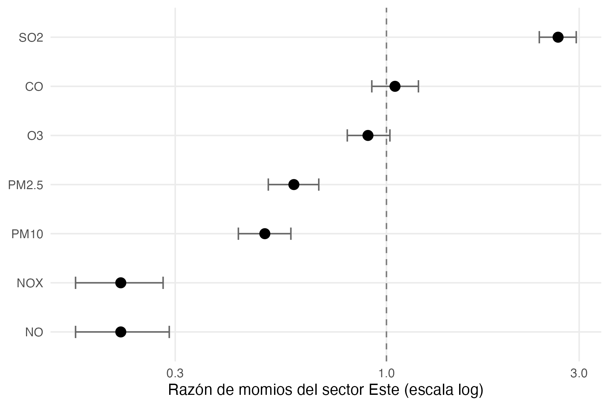

```{r}
#| label: carga

library(tidyverse)
library(knitr)

resultados_e3 <- readRDS("objetos_reporte_etapa3.rds")
resultados_e4 <- readRDS("objetos_reporte_etapa4.rds")

tabla_reporte <- function(datos, leyenda, digitos = 2) {
  kable(datos, caption = leyenda, digits = digitos, booktabs = TRUE)
}
```

# Introducción y justificación

La calidad del aire condiciona de manera directa el bienestar de la población y el estado de los ecosistemas, ya que depende de la presencia y concentración de distintos contaminantes en la atmósfera. Cuando estos alcanzan niveles elevados pueden generar efectos adversos sobre la salud respiratoria y cardiovascular. Por esa razón, el monitoreo continuo permite identificar condiciones de riesgo y generar información útil para reducir la exposición de la población y apoyar la toma de decisiones públicas (Holcim España, s. f.).

La magnitud del problema es considerable. La Organización Mundial de la Salud estima que la contaminación del aire exterior ocasionó alrededor de 4.2 millones de muertes prematuras en 2019, y la asocia con enfermedades cardiovasculares, padecimientos respiratorios, accidentes cerebrovasculares y cáncer de pulmón (Organización Mundial de la Salud, 2024). Entre los contaminantes de mayor relevancia se encuentran las partículas suspendidas, el ozono, el dióxido de nitrógeno, el monóxido de carbono y el dióxido de azufre. Este último presenta una particularidad importante para el presente trabajo: sus efectos documentados corresponden principalmente a exposiciones de corta duración, lo que implica que su evaluación requiere métricas sensibles a eventos agudos y no únicamente a niveles promedio (Organización Mundial de la Salud, 2021).

El marco normativo refleja esa distinción de manera parcial. A nivel internacional, las directrices de la Organización Mundial de la Salud (2021) establecen valores guía para los principales contaminantes, sin carácter legalmente vinculante. En México, los límites para la protección de la salud se definen mediante normas oficiales mexicanas, y la NOM-172-SEMARNAT establece los lineamientos para la obtención y comunicación del Índice de Calidad del Aire y Riesgos a la Salud (Secretaría de Medio Ambiente y Recursos Naturales, 2023; Comisión Federal para la Protección contra Riesgos Sanitarios, s. f.). Un aspecto que conviene señalar es que los límites nacionales no siempre coinciden con las recomendaciones internacionales, por lo que el cumplimiento normativo no implica de manera automática la ausencia de riesgo.

La medición de la calidad del aire enfrenta además dificultades operativas. La cobertura espacial de las estaciones es limitada, los equipos requieren mantenimiento y calibración periódicos, y los registros presentan datos faltantes con frecuencia. Cada estación representa fundamentalmente las condiciones de su entorno inmediato, lo que obliga a validar y depurar la información antes de cualquier análisis estadístico (Instituto Nacional de Ecología y Cambio Climático, s. f.; Programa de las Naciones Unidas para el Medio Ambiente, 2022). En Nuevo León, el Sistema Integral de Monitoreo Ambiental registra contaminantes atmosféricos y variables meteorológicas en distintos puntos del Área Metropolitana de Monterrey, y sus series históricas constituyen la fuente de datos de este proyecto (Gobierno del Estado de Nuevo León, s. f.).

## Antecedentes

La identificación del origen de episodios de contaminación a partir de datos de monitoreo tiene una tradición metodológica consolidada. Ashbaugh, Malm y Sadeh (1985) propusieron la función de probabilidad condicional, que relaciona las concentraciones registradas con la dirección del viento para estimar qué sectores se asocian con valores elevados. Carslaw, Beevers, Ropkins y Bell (2006) extendieron este tipo de análisis al estudio de contribuciones de fuentes específicas en entornos con múltiples emisores, y Carslaw y Ropkins (2012) incorporaron estas herramientas al paquete openair del entorno R, lo que facilitó su aplicación sistemática.

Uria-Tellaetxe y Carslaw (2014) desarrollaron la función de probabilidad bivariada condicional como extensión del método anterior. Su aportación consiste en incorporar la velocidad del viento además de la dirección, lo que proporciona información sobre las características de dispersión de la fuente y no solo sobre su ubicación angular. Los autores validaron el procedimiento mediante simulaciones de dispersión. Esta metodología resulta pertinente para el presente estudio porque permite examinar si los episodios elevados de dióxido de azufre aparecen de forma repetida bajo combinaciones específicas de dirección y velocidad del viento.

Clarke, Kwon y Choi (2014) aplicaron un enfoque de identificación de fuentes en Ulsan, Corea del Sur, una ciudad con actividad industrial intensa, utilizando concentraciones horarias de varios contaminantes registradas en trece estaciones automáticas. Los resultados mostraron una relación particularmente definida para el dióxido de azufre, cuyo origen los autores atribuyeron principalmente a áreas industriales locales. El trabajo constituye un antecedente directo porque demuestra que los registros rutinarios de una red de monitoreo pueden emplearse para estudiar relaciones entre fuentes y receptores, y no solo para describir niveles de concentración.

Por último, Xue, Cui, Li, Yu y Ma (2023) estudiaron episodios recurrentes de contaminación por dióxido de azufre en un parque industrial químico. A partir de las mediciones de una sola estación identificaron sesenta y ocho eventos y realizaron un análisis retrospectivo de su posible origen, que asociaron con una unidad de craqueo catalítico. El estudio reconoce explícitamente la limitación de contar con un único monitor, y muestra cómo la combinación de observaciones con información meteorológica permite reducir esa incertidumbre.

## Justificación

Los antecedentes revisados coinciden en que el análisis conjunto de concentraciones y variables meteorológicas permite identificar patrones compatibles con fuentes de emisión específicas. Sin embargo, ninguno de estos trabajos aborda una cuestión que resulta central para la gestión de la calidad del aire: si los indicadores estadísticos empleados habitualmente en los instrumentos de planeación representan de manera adecuada la exposición que efectivamente experimenta la población cercana a una fuente puntual.

Este proyecto aplica el enfoque direccional a los registros históricos del Sistema Integral de Monitoreo Ambiental y lo extiende en esa dirección. La aportación no se limita a establecer si existe un patrón asociado a un sector determinado, sino que cuantifica la magnitud de la exposición aguda vinculada a ese sector y la contrasta con lo que reportarían las medidas de tendencia central. El resultado tiene una aplicación concreta para el socio formador, ya que permite evaluar si los mecanismos de seguimiento vigentes capturan el fenómeno que buscan vigilar.

# Problemática y objetivo

## Planteamiento

El Área Metropolitana de Monterrey concentra una parte considerable de la actividad industrial del noreste del país, y su configuración geográfica favorece la acumulación de contaminantes. La zona se encuentra parcialmente delimitada por elevaciones de la Sierra Madre Oriental, lo que genera una cuenca atmosférica semicerrada donde la dispersión depende de manera crítica del régimen de vientos.

Dentro de este contexto, el dióxido de azufre presenta un comportamiento distinto al de los demás contaminantes criterio. Su origen se asocia principalmente a la combustión de hidrocarburos con contenido de azufre, característica de procesos industriales específicos, más que al tráfico vehicular distribuido en la mancha urbana. Esta particularidad lo convierte en un trazador útil para el estudio de fuentes puntuales.

El problema que motiva este trabajo es de naturaleza metodológica antes que descriptiva. Las concentraciones promedio permiten caracterizar el comportamiento general del contaminante, pero pueden ocultar episodios cortos de concentraciones elevadas. Si la contribución de una fuente industrial se manifiesta en forma de eventos agudos de pocas horas, un sistema de seguimiento basado en promedios anuales podría reportar condiciones estables mientras la exposición real de la población cercana se deteriora.

## Evolución del objetivo

Durante las primeras etapas del proyecto el objetivo se formuló como una pregunta de identificación: determinar si existía un patrón direccional y meteorológico en las concentraciones de dióxido de azufre consistente con la influencia de una fuente industrial puntual. Los resultados de la etapa de modelado permitieron considerar esa pregunta resuelta. El modelo direccional identificó el sector este sin recibir información previa sobre la ubicación de la fuente, y ese sector coincide con el azimut geodésico del complejo refinador. Las pruebas de falsación multicontaminante descartaron las explicaciones alternativas evaluadas.

Resuelta la identificación, el problema abierto pasó a ser la cuantificación. Por esa razón el objetivo se reformuló, conservando el marco de análisis de fuentes industriales puntuales pero desplazando el énfasis desde la atribución hacia la medición de la exposición y la evaluación de los indicadores empleados para vigilarla.

## Objetivo general

Cuantificar el exceso de exposición aguda a dióxido de azufre asociado al sector direccional donde se ubica el complejo refinador de Cadereyta, con el fin de evaluar si los indicadores de tendencia central que utilizan actualmente los instrumentos de gestión de la calidad del aire representan de manera adecuada dicha exposición.

## Objetivos específicos

1.  Caracterizar la frecuencia y duración de los episodios de concentración elevada de dióxido de azufre en cuatro estaciones ordenadas por su distancia al complejo refinador.
2.  Estimar la asociación entre el sector direccional del viento y la probabilidad de episodio, controlando por condiciones meteorológicas y por la persistencia temporal del propio contaminante.
3.  Evaluar la especificidad química de esa asociación mediante pruebas de falsación con trazadores de combustión urbana y mediante el examen de la estructura multivariada de la matriz de contaminantes.
4.  Contrastar la magnitud de las diferencias de tendencia central entre estaciones frente a la frecuencia de eventos agudos, y derivar de ese contraste recomendaciones para el seguimiento de la calidad del aire.

## Pregunta de investigación

¿Los episodios elevados de dióxido de azufre presentan un patrón de dirección del viento y distancia consistente con la influencia de una fuente industrial localizada en la zona de Cadereyta, y qué magnitud de exposición aguda queda sin registrar cuando ese fenómeno se evalúa mediante medidas de tendencia central?

## Contexto geográfico de las estaciones de monitoreo

El análisis emplea cuatro estaciones de la red del Sistema Integral de Monitoreo Ambiental, seleccionadas por su posición relativa respecto al complejo refinador. El criterio de selección no fue la proximidad en sí misma, sino la posibilidad de construir un gradiente de distancia sobre el cual evaluar el comportamiento de la señal.

```{r}
#| label: tbl-estaciones

resultados_e3$geo %>%
  mutate(
    Municipio = c("Cadereyta Jiménez", "Juárez", "San Nicolás de los Garza", "García"),
    Papel = c("Estación de exposición", "Distancia intermedia",
              "Distancia lejana", "Estación de control")
  ) %>%
  select(Estacion, Municipio, azimut, rumbo, dist_km, Papel) %>%
  rename(
    `Estación` = Estacion,
    `Azimut (°)` = azimut,
    `Rumbo` = rumbo,
    `Distancia (km)` = dist_km
  ) %>%
  tabla_reporte(
    leyenda = "El azimut corresponde al ángulo geodésico desde la estación hacia el centroide del complejo, medido en sentido horario desde el norte. Las coordenadas de referencia son aproximadas y su efecto sobre la identificación del sector se evalúa al final de esta sección.",
    digitos = 1
  )
```

La estación SE3 se localiza en Cadereyta Jiménez, a 5.5 kilómetros del complejo refinador y en un azimut de 87.3 grados, correspondiente al rumbo este franco. Su entorno inmediato es de baja densidad vehicular en comparación con el núcleo metropolitano, característica que resulta favorable para el análisis porque reduce la contribución de fuentes difusas de combustión. La estación SE2, en Juárez, se ubica a 16.4 kilómetros, y NE, en San Nicolás de los Garza, a 35.7 kilómetros, ambas dentro de la zona conurbada y con exposición creciente al tráfico vehicular metropolitano.

La estación GAR, en García, cumple una función de control. Se encuentra a 68.5 kilómetros del complejo, en el extremo occidental del área metropolitana, de manera que se ubica en contra del patrón de viento dominante respecto de la fuente estudiada. Conviene precisar un aspecto de su geometría: aunque el azimut hacia el complejo es de 110.1 grados, ese sector direccional comprende la totalidad de la mancha urbana antes de alcanzar la refinería. En consecuencia, cualquier señal asociada al sector oriental en GAR corresponde a influencia urbana difusa y no a transporte desde la fuente puntual, lo que refuerza su papel como referencia.

Un rasgo geográfico común a las cuatro estaciones merece atención. Las cuatro tienen el complejo refinador hacia el este o el este sureste, con azimuts comprendidos entre 87 y 120 grados. Esta circunstancia permite un contraste informativo: si el sector oriental estuviera asociado a concentraciones elevadas por razones meteorológicas generales, como el régimen de brisa o patrones sinópticos regionales, las cuatro estaciones deberían presentar asociaciones de magnitud comparable. La atenuación sistemática de la señal con la distancia, documentada en la sección de resultados, es incompatible con esa explicación.

Las coordenadas empleadas para ubicar el complejo refinador corresponden a una estimación de su centroide y no a un levantamiento topográfico, por lo que los azimuts y distancias reportados deben entenderse como valores aproximados. Esta imprecisión no compromete la identificación del sector direccional por dos razones. La primera es de escala: el complejo ocupa una superficie aproximada de 612 hectáreas, de modo que no constituye un punto sino una extensión, y cualquier coordenada individual es necesariamente una simplificación. La segunda es de resolución del método: la clasificación direccional emplea sectores de 22.5 grados, una banda considerablemente más amplia que el error plausible en la ubicación del centroide.

Para verificar esta afirmación se evaluó la sensibilidad del cálculo desplazando el centroide 1.5 kilómetros en cada dirección cardinal. El azimut resultante desde SE3 oscila entre 72.4 y 102.7 grados y permanece en todos los casos dentro de la banda comprendida entre el este noreste y el este sureste. En consecuencia, la coincidencia entre el sector que el modelo identificó de manera independiente y la ubicación de la fuente no depende de la precisión del punto tomado como referencia.

# Preparación de la base de datos

## Origen y estructura

La información procede de los archivos horarios de la red del Sistema Integral de Monitoreo Ambiental correspondientes a los años 2022 a 2025, complementados con el catálogo de etiquetas y rangos de validación de los parámetros. Cada archivo anual contiene una hoja por estación de monitoreo, con registros horarios de contaminantes criterio y variables meteorológicas.

La base de trabajo se construyó uniendo las cuatro estaciones seleccionadas a lo largo de los cuatro años, y quedó integrada por 132,936 registros horarios y 21 variables. Comprende ocho contaminantes, dióxido de azufre, óxidos de nitrógeno, óxido nítrico, dióxido de nitrógeno, monóxido de carbono, ozono y material particulado en sus fracciones PM10 y PM2.5, además de dirección y velocidad del viento, temperatura, humedad relativa, presión atmosférica, radiación solar y precipitación.

```{r}
#| label: tbl-variables

tibble(
  Variable = c("SO2", "NOX, NO, NO2", "CO", "O3", "PM10, PM2.5",
               "WDR", "WSR", "TOUT", "RH", "PRS", "SR", "RAINF"),
  `Descripción` = c(
    "Dióxido de azufre",
    "Óxidos de nitrógeno totales, óxido nítrico y dióxido de nitrógeno",
    "Monóxido de carbono",
    "Ozono",
    "Material particulado menor de 10 y 2.5 micrómetros",
    "Dirección del viento",
    "Velocidad del viento",
    "Temperatura exterior",
    "Humedad relativa",
    "Presión atmosférica",
    "Radiación solar",
    "Precipitación"
  ),
  Unidad = c("ppb", "ppb", "ppm", "ppb", "µg/m³",
             "grados", "km/h", "°C", "%", "mmHg", "kW/m²", "mm"),
  `Papel en el análisis` = c(
    "Variable de interés",
    "Trazador de falsación",
    "Trazador de falsación",
    "Trazador de falsación",
    "Trazador de falsación",
    "Variable direccional",
    "Control meteorológico",
    "Control meteorológico",
    "Control meteorológico",
    "Control meteorológico",
    "Control meteorológico",
    "Control meteorológico"
  )
) %>%
  tabla_reporte(
    leyenda = "Variables empleadas en el análisis, con su unidad de medida y su función dentro del diseño."
  )
```

## Validación por rangos instrumentales

La revisión inicial de los datos identificó registros fuera de los intervalos físicamente posibles, entre ellos valores de menos nueve mil novecientos noventa y nueve en temperatura y humedad relativa, que corresponden a códigos de falla del equipo, así como humedades relativas superiores al cien por ciento y presiones fuera del rango barométrico de la región. La magnitud de esta variación entre años no es menor. El límite superior de validación del dióxido de azufre, por ejemplo, pasa de 200 partes por billón en 2022 a 250 en 2023, 150 en 2024 y 405 en 2025, de modo que aplicar el criterio de un solo año al periodo completo habría invalidado mediciones legítimas o conservado registros que el propio catálogo considera fuera de operación.

El tratamiento aplicado consistió en convertir a valor faltante toda observación situada fuera del rango de validación correspondiente, utilizando la tabla de referencia proporcionada por el socio formador. Un aspecto metodológico relevante es que esos rangos no son constantes a lo largo del periodo, ya que reflejan cambios en la instrumentación de la red. Por esa razón la validación se aplicó mediante la combinación de año y variable, y no imponiendo los límites de un solo año a la serie completa. Este procedimiento no elimina observaciones, únicamente marca como faltantes aquellas que el propio catálogo del sistema considera no válidas.

## Tratamiento de datos faltantes

El criterio de imputación se estableció de manera diferenciada según la función de cada variable dentro del diseño, y responde a una consideración de validez antes que de completitud.

Las variables meteorológicas de control, temperatura, humedad relativa, presión y radiación solar, recibieron imputación mediante el método de vecinos más cercanos. Se trata de variables continuas con alta autocorrelación temporal y fuerte estructura cíclica diaria y estacional, de modo que su valor en una hora determinada es predecible a partir de horas contiguas con características similares. Su función en el análisis es servir como controles, por lo que una imputación razonable preserva la capacidad del modelo de aislar el efecto direccional sin introducir información sustantiva sobre la variable de interés.

Los contaminantes conservaron sus valores faltantes sin imputación alguna. Esta decisión es deliberada y constituye un requisito del diseño. Las concentraciones de óxidos de nitrógeno, monóxido de carbono y material particulado cumplen la función de trazadores de falsación, es decir, se utilizan para verificar si responden o no al mismo patrón direccional que el dióxido de azufre. Imputar esos valores equivaldría a fabricar precisamente los contrastes que el análisis busca someter a prueba. La ausencia de respuesta en un trazador solo constituye evidencia si corresponde a mediciones reales.

Por la misma razón, el dióxido de azufre no fue objeto de imputación ni de depuración por valores extremos. La aplicación de un criterio automático de eliminación de atípicos, como el basado en el rango intercuartílico, habría suprimido las horas de concentración elevada, que son el objeto mismo del estudio. Los valores extremos de esta variable se interpretan como señal y no como ruido de medición, siempre que se encuentren dentro del rango instrumental válido.

## Tratamiento circular de la dirección del viento

La dirección del viento es una variable circular, en la cual los valores cero y trescientos sesenta grados representan la misma condición física. Su tratamiento como variable lineal produciría resultados incorrectos, ya que el promedio aritmético de rumbos próximos al norte arrojaría valores del sector sur.

Se aplicaron tres transformaciones complementarias. La primera consiste en la clasificación en dieciséis sectores de 22.5 grados, que permite incorporar el rumbo como factor categórico sin imponer una relación de orden. La segunda corresponde a la descomposición en componentes seno y coseno, que preserva la continuidad angular. La tercera es la agrupación binaria del sector oriental, definido como la unión de los rumbos este noreste, este y este sureste, frente al conjunto de las direcciones restantes, especificación que se emplea en los modelos comparativos entre estaciones.

De manera análoga, la hora del día y el mes del año se incorporaron mediante términos armónicos de seno y coseno, de modo que la vigésimo tercera hora resulte contigua a la hora cero y el mes de diciembre contiguo a enero.

## Consideraciones sobre la estructura del panel

El conjunto resultante constituye un panel deliberadamente no balanceado. Las cuatro estaciones no registran el mismo número de observaciones válidas, con un rango que va de 32,534 horas en GAR a 33,977 en SE3. Esta diferencia refleja la disponibilidad efectiva de los sensores durante el periodo y no un error de construcción de la base. No se aplicó ningún procedimiento de igualación, ya que hacerlo implicaría descartar información válida para satisfacer una simetría que el análisis no requiere.

Finalmente, conviene señalar una corrección respecto a documentos de etapas previas. Las concentraciones de dióxido de azufre se expresan en partes por billón y la velocidad del viento en kilómetros por hora, conforme al catálogo de parámetros del sistema de monitoreo. En materiales anteriores estas magnitudes aparecieron con unidades incorrectas, situación que se corrige en el presente reporte y que no afecta los resultados, dado que todos los cálculos se realizaron sobre los valores originales.

# Modelación y validación

## Criterio de selección de técnicas

La elección de los métodos respondió a tres características del fenómeno estudiado. La primera es que el objeto de interés son eventos discretos y poco frecuentes, no niveles continuos. La segunda es la marcada asimetría de la distribución del dióxido de azufre, con una razón entre el percentil 99 y la mediana de 12.57 en la estación más próxima a la fuente. La tercera es la naturaleza circular de la variable direccional, que impide su tratamiento como magnitud lineal.

Por esas razones se descartó el modelo de regresión lineal. Un modelo de ese tipo promediaría las horas de episodio, que representan el 11.6 por ciento de los registros en SE3, con las horas de comportamiento regular, diluyendo precisamente la señal que se busca caracterizar. Además, la asimetría de la distribución vulnera el supuesto de normalidad de los residuos.

## Técnica de relaciones de dependencia: regresión logística binaria

Se definió como episodio toda hora con concentración de dióxido de azufre superior a 11.1 partes por billón, valor correspondiente al percentil 95 del conjunto de las cuatro estaciones. La adopción de un umbral absoluto común resulta indispensable para la comparabilidad entre sitios. Un percentil calculado de manera individual para cada estación forzaría por construcción la misma proporción de episodios en todos los puntos, ocultando exactamente la diferencia espacial que el análisis busca medir.

Sobre esa variable binaria se estimó un modelo de regresión logística. La especificación incorpora el rumbo del viento como factor de dieciséis niveles sin jerarquía previa, controles meteorológicos mediante splines naturales de tres grados de libertad, y términos armónicos para hora y mes. El uso de splines en lugar de términos lineales obedece a que la relación entre velocidad del viento y probabilidad de episodio no es monótona: las condiciones de calma favorecen la acumulación local, mientras que las velocidades elevadas dispersan, de modo que el máximo se ubica en valores intermedios.

La regresión logística ofrece dos ventajas para este diseño. Modela directamente la probabilidad del evento, sin necesidad de transformar la variable de respuesta, y produce razones de momios que resultan interpretables y comparables entre estaciones y entre contaminantes medidos en unidades distintas.

## Técnicas de relaciones de interdependencia: componentes principales y conglomerados

El análisis direccional depende enteramente de la información meteorológica. Para obtener una verificación que no comparta ese supuesto se aplicaron dos técnicas de interdependencia sobre la matriz química de los ocho contaminantes, sin utilizar en ningún momento la dirección del viento.

El análisis de componentes principales examina si el dióxido de azufre comparte estructura de variación con los trazadores vehiculares. Si el contaminante de interés cargara de manera apreciable sobre el mismo eje que los óxidos de nitrógeno y el monóxido de carbono, la hipótesis de una fuente distinta a la combustión urbana quedaría debilitada con independencia del patrón direccional observado. Las variables se transformaron logarítmicamente y se estandarizaron antes del análisis. La transformación logarítmica atenúa la influencia de los valores extremos sobre la matriz de correlaciones sin eliminarlos del conjunto de observaciones.

El análisis de conglomerados por el método de k medias se aplicó sobre las puntuaciones de los primeros cuatro componentes, con el propósito de identificar perfiles horarios concretos. La agrupación emplea exclusivamente información química, y la asociación de los grupos resultantes con el sector direccional se examina con posterioridad, de manera que el algoritmo no dispone de información que pudiera inducir el resultado buscado.

## Técnicas complementarias

Se emplearon tres procedimientos adicionales con funciones específicas dentro del diseño.

La prueba de Kruskal-Wallis y el estimador de desplazamiento de Hodges-Lehmann permiten cuantificar diferencias típicas entre estaciones sin asumir normalidad. Su papel consiste en contrastar de manera explícita la magnitud de las diferencias de tendencia central frente a la frecuencia de eventos agudos, que constituye el argumento central del trabajo.

La función de probabilidad bivariada condicional estima la misma cantidad que el modelo logístico, es decir, la probabilidad de concentración elevada condicionada a las condiciones de viento, pero por vía no paramétrica y sin control de covariables. Su valor reside en que parte de supuestos distintos: la coincidencia entre ambos enfoques constituye evidencia de robustez y no una duplicación del análisis.

El modelo con rezagos horarios del propio contaminante responde a una explicación alternativa específica. Dado que las concentraciones en horas consecutivas están correlacionadas, el patrón direccional podría reflejar simplemente la persistencia del dióxido de azufre y no una asociación con el rumbo del viento. Los rezagos se construyeron sobre una rejilla horaria completa para evitar tratar como consecutivas dos mediciones separadas por una hora faltante.

## Estrategia confirmatoria

Las técnicas anteriores se organizaron en una secuencia en la que cada paso responde a una explicación alternativa distinta. La lógica no consiste en acumular evidencia favorable, sino en someter la hipótesis a condiciones que podrían refutarla.

```{r}
#| label: tbl-sustento

resultados_e4$matriz_sustento %>%
  rename(
    Pregunta = Pregunta,
    `Método` = Metodo,
    `Qué comprueba` = Que_comprueba
  ) %>%
  tabla_reporte(
    leyenda = "Correspondencia entre cada pregunta de validación, el método empleado para responderla y la explicación alternativa que permite descartar."
  )
```

El elemento central de esta estrategia es que las variables que no responden constituyen la evidencia más sólida. Si los episodios de dióxido de azufre se debieran al tráfico vehicular o a la combustión urbana difusa, los óxidos de nitrógeno y el monóxido de carbono deberían incrementarse de manera simultánea, ya que ambos procesos los generan de forma conjunta. La ausencia de respuesta direccional en esos trazadores, o su respuesta en sentido contrario, es incompatible con dichas explicaciones.

## Procedimientos de validación

Los modelos se sometieron a cinco verificaciones independientes.

La validación fuera de muestra consistió en estimar los modelos con los años 2022 a 2024 y evaluarlos sobre 2025, un año que el procedimiento de ajuste nunca observó. Se reportan el área bajo la curva ROC, que mide capacidad de discriminación, y el error de Brier, que evalúa la calibración de las probabilidades predichas.

La inferencia robusta atiende el hecho de que las observaciones horarias de un mismo día no son independientes entre sí. Los errores estándar se recalcularon agrupando por día, lo que corrige la subestimación de la incertidumbre que produciría el supuesto de independencia.

El análisis de sensibilidad al umbral replicó la estimación con los percentiles 90, 95 y 99, con el fin de verificar que las conclusiones no dependen del corte seleccionado.

El diagnóstico de autocorrelación residual evalúa si el modelo captura adecuadamente la dependencia temporal. Una autocorrelación importante en los residuos indicaría que la especificación omite estructura relevante.

La evaluación de la calibración compara, por deciles de riesgo predicho, la probabilidad estimada frente a la proporción de episodios efectivamente observada. Esta verificación resulta pertinente porque un modelo puede discriminar correctamente y aun así producir probabilidades sesgadas.

## Especificaciones exploradas que no resultaron viables

Tres aproximaciones se evaluaron durante el desarrollo del análisis y se descartaron por razones que conviene documentar.

El modelo de regresión lineal sobre la concentración de dióxido de azufre se consideró en una fase inicial y se abandonó por las razones expuestas al inicio de esta sección. Sus resultados se incluyen en el Anexo A.

El análisis de conglomerados con la partición sugerida por el índice de silueta, que favorece dos grupos, resultó menos informativo que la partición en cuatro. El detalle de esta decisión se presenta en el Anexo B.

La estimación del modelo direccional en la estación de control con el umbral más exigente no fue posible, debido a que esa estación registra menos de treinta horas por encima de 30.6 partes por billón en cuatro años. Esta imposibilidad constituye en sí misma un resultado y se discute en la sección correspondiente.

# Resultados

## Caracterización de los episodios

El primer resultado corresponde a la distribución de los episodios entre las cuatro estaciones. La comparación emplea el umbral absoluto común de 11.1 partes por billón.

```{r}
#| label: tbl-episodios

resultados_e4$resumen_estaciones %>%
  select(Estacion, n, episodios, tasa_pct, P50, P99, razon_P99_P50) %>%
  setNames(c("Estación", "Horas válidas", "Episodios", "Tasa (%)",
             "Mediana", "P99", "P99 / Mediana")) %>%
  tabla_reporte(
    leyenda = "Frecuencia de episodios de dióxido de azufre por estación, con umbral absoluto de 11.1 ppb. Las concentraciones se expresan en partes por billón.",
    digitos = 2
  )
```

El contraste entre estaciones es pronunciado. SE3 registra 3,951 horas de episodio, equivalentes al 11.63 por ciento de sus registros válidos, mientras que GAR acumula 49 horas en el mismo periodo, es decir, el 0.15 por ciento. La diferencia entre ambas es de aproximadamente setenta y siete veces.

Conviene observar que esa diferencia no se refleja en los valores centrales. Las medianas de las cuatro estaciones se sitúan entre 3.3 y 4.4 partes por billón, un rango estrecho. Lo que distingue a SE3 no es su nivel habitual sino el comportamiento de la cola superior de su distribución: su percentil 99 alcanza 55.3 partes por billón, frente a 7.4 en la estación de control. La razón entre el percentil 99 y la mediana resume esta característica, con un valor de 12.57 en SE3 que desciende de manera ordenada hasta 2.24 en GAR.

Este resultado anticipa el argumento central del trabajo. El fenómeno reside en la frecuencia de eventos agudos y no en el nivel de fondo, de modo que cualquier indicador construido sobre medidas de tendencia central captará solo una fracción reducida de la diferencia entre ambos sitios.

## Asociación direccional

El modelo logístico se estimó sobre la estación SE3 incorporando los dieciséis rumbos como categorías equivalentes, con el norte como referencia, y controlando por velocidad del viento, hora y mes.

```{r}
#| label: tbl-momios16

resultados_e4$momios_16_rumbos %>%
  slice(c(1:5, 11:15)) %>%
  mutate(
    IC = sprintf("[%.2f, %.2f]", IC_inf, IC_sup),
    p = format.pval(p, digits = 2, eps = 1e-16)
  ) %>%
  select(Rumbo, OR, IC, p) %>%
  setNames(c("Rumbo", "Razón de momios", "IC 95%", "Valor p")) %>%
  tabla_reporte(
    leyenda = "Razones de momios por rumbo del viento en SE3, con el norte como categoría de referencia. Se presentan los cinco rumbos de mayor y de menor asociación; la tabla completa se incluye en el Anexo C.",
    digitos = 2
  )
```

El rumbo este presenta la mayor razón de momios, con un valor de 6.12 y un intervalo de confianza al 95 por ciento comprendido entre 4.73 y 7.92. Le siguen los rumbos este sureste, con 2.58, y este noreste, con 1.98. El modelo identificó este ordenamiento sin recibir información alguna sobre la ubicación de la fuente investigada, ya que los dieciséis rumbos se introdujeron como categorías sin jerarquía previa.

El comportamiento del cuadrante opuesto resulta igualmente informativo. Los rumbos noroeste, nor noroeste, oeste y oeste noroeste presentan razones de momios comprendidas entre 0.08 y 0.25, lo que representa reducciones de entre cuatro y doce veces respecto de la categoría de referencia. Este resultado admite una lectura de falsación directa: dado que el núcleo del Área Metropolitana de Monterrey se localiza al oeste de Cadereyta, si los episodios fueran atribuibles a la mancha urbana o al tráfico vehicular metropolitano cabría esperar momios elevados con vientos de ese sector. Se observa exactamente el comportamiento inverso.

El modelo completo resulta significativo frente al modelo nulo, con una diferencia de devianza de 4,617.2 sobre 22 grados de libertad, y alcanza un área bajo la curva ROC de 0.811.

La verificación geográfica se realizó con posterioridad a la estimación, calculando el azimut desde cada estación hacia el complejo refinador, según se documentó en la sección de contexto. Desde SE3, la fuente se localiza en un azimut cercano a los 87 grados, correspondiente al rumbo este, que es el mismo que el modelo señaló de manera independiente.

## Gradiente espacial

Si la asociación con el sector oriental respondiera a condiciones meteorológicas regionales y no a la presencia de una fuente puntual, las cuatro estaciones deberían presentar momios comparables, dado que todas tienen el complejo hacia el este o el este sureste.

```{r}
#| label: fig-gradiente
#| fig-cap: "Razón de momios del sector Este sobre la probabilidad de episodio, en función de la distancia de cada estación al complejo refinador. Las barras representan el intervalo de confianza al 95 por ciento y la línea punteada corresponde a la ausencia de efecto."
#| out-width: "80%"

knitr::include_graphics("figuras/gradiente_distancia.png")
```

El efecto se atenúa de manera sistemática con la distancia. En SE3, a 5.5 kilómetros, la razón de momios es de 3.19. En SE2, a 16.4 kilómetros, desciende a 1.58. En NE, a 35.7 kilómetros, alcanza 1.01, con un intervalo de confianza que incluye la unidad, lo que indica ausencia de efecto detectable. En esta última estación la coincidencia direccional con la fuente no produce incremento alguno en la probabilidad de episodio.

El patrón requiere la conjunción de dirección y proximidad, comportamiento característico de una pluma sujeta a dilución progresiva y no de un artefacto direccional de escala regional.

El caso de la estación de control merece una precisión. Su razón de momios de 1.08, con un intervalo amplio que incluye la unidad, resulta consistente con la influencia urbana difusa señalada en la sección de contexto geográfico, dado que su sector oriental comprende la totalidad de la zona metropolitana antes de alcanzar el complejo refinador.

La diferencia entre estaciones se verificó de manera formal mediante un modelo conjunto con interacción entre estación y sector. La prueba resulta significativa, con una diferencia de devianza de 195.77 sobre tres grados de libertad, y tanto el criterio de información de Akaike como el bayesiano favorecen la especificación que permite efectos distintos por estación.

```{r}
#| label: tbl-contrastes

resultados_e4$contrastes_por_estacion %>%
  as_tibble() %>%
  mutate(
    OR = exp(estimate),
    IC = sprintf("[%.2f, %.2f]", exp(asymp.LCL), exp(asymp.UCL)),
    p = format.pval(p.value, digits = 2, eps = 1e-16)
  ) %>%
  select(Estacion, OR, IC, p) %>%
  setNames(c("Estación", "Razón de momios", "IC 95%", "Valor p")) %>%
  tabla_reporte(
    leyenda = "Contraste del sector Este frente al resto de direcciones, estimado por estación en el modelo conjunto con controles específicos.",
    digitos = 2
  )
```

Los contrastes por estación confirman el patrón: la asociación es significativa en SE3 y SE2, y deja de serlo en NE y GAR, donde los valores p superan ampliamente cualquier nivel convencional.

## Persistencia del patrón ante controles meteorológicos

Una explicación alternativa plausible es que la asociación direccional refleje condiciones meteorológicas correlacionadas con el rumbo del viento y no la presencia de una fuente. Para evaluarla se amplió el modelo con temperatura, humedad relativa, presión atmosférica, radiación solar y precipitación, todas mediante splines naturales.

La selección por criterio bayesiano de información retuvo las cinco variables meteorológicas y descartó únicamente la precipitación. La pregunta relevante es si el bloque direccional conserva capacidad explicativa una vez incorporados esos controles. La prueba de razón de verosimilitudes entre el modelo meteorológico con dirección y el mismo modelo sin ella arroja una diferencia de devianza de 1,192.7 sobre quince grados de libertad, con un valor p inferior a cualquier nivel convencional.

```{r}
#| label: tbl-valmeteo

resultados_e4$validacion_meteo_2025 %>%
  setNames(c("Modelo", "AUC", "Error de Brier")) %>%
  tabla_reporte(
    leyenda = "Desempeño fuera de muestra en 2025 del modelo direccional frente al modelo con controles meteorológicos ampliados. Ambos fueron estimados con los años 2022 a 2024.",
    digitos = 3
  )
```

Un resultado que conviene señalar por su carácter negativo es que la ampliación meteorológica apenas modifica la capacidad predictiva: el área bajo la curva pasa de 0.789 a 0.794 y el error de Brier se deteriora ligeramente. Es decir, las variables meteorológicas adicionales no explican los episodios por sí solas ni desplazan al sector direccional, lo cual es precisamente la conclusión que interesa. La dirección del viento aporta información que la meteorología general no contiene.

## Persistencia del patrón ante la memoria temporal del contaminante

La segunda explicación alternativa es de naturaleza temporal. Dado que las concentraciones en horas consecutivas están correlacionadas, el patrón direccional podría reflejar la simple persistencia del contaminante: si una hora presenta concentración elevada, la siguiente tenderá a presentarla también, con independencia del rumbo del viento.

El diagnóstico de autocorrelación de los residuos confirma que este mecanismo opera. En el modelo base, la correlación entre residuos separados por una hora alcanza 0.484, y la incorporación de controles meteorológicos apenas la reduce a 0.471. La meteorología no sustituye un tratamiento explícito de la dependencia temporal.

Por esa razón se incorporaron rezagos horarios de la propia concentración, construidos sobre una rejilla horaria completa. La selección por criterio bayesiano retuvo los rezagos de una, dos, doce y veinticuatro horas. Su aportación es considerable, con una diferencia de devianza de 5,187.7 sobre cuatro grados de libertad. Aun así, el sector oriental conserva una razón de momios de 3.34, con intervalo de confianza entre 3.03 y 3.68.

```{r}
#| label: fig-acf
#| fig-cap: "Autocorrelación de los residuos de devianza en función del rezago horario, para el modelo base, el modelo con controles meteorológicos ampliados y el modelo integrado."
#| out-width: "85%"

knitr::include_graphics("figuras/autocorrelacion_residual.png")
```

## Modelo integrado

Las dos explicaciones alternativas anteriores se evaluaron de manera conjunta mediante cuatro modelos anidados estimados sobre exactamente las mismas 31,745 observaciones, condición necesaria para que los criterios de información y las pruebas de razón de verosimilitudes resulten comparables.

```{r}
#| label: tbl-integrado

resultados_e4$comparacion_integrada %>%
  setNames(c("Modelo", "AIC", "BIC")) %>%
  tabla_reporte(
    leyenda = "Criterios de información de los cuatro modelos anidados, estimados sobre las mismas observaciones del periodo 2022 a 2024. Valores menores indican mejor ajuste penalizado.",
    digitos = 1
  )
```

Dos pruebas establecen que los bloques son complementarios y no redundantes. Los rezagos aportan información después de controlar por meteorología, con una diferencia de devianza de 3,364.6 sobre cuatro grados de libertad. La meteorología aporta información después de controlar por la memoria temporal, con una diferencia de 245.7 sobre doce grados de libertad.

La prueba central del análisis consiste en eliminar el sector direccional del modelo integrado, conservando simultáneamente la meteorología ampliada y los rezagos. La devianza se deteriora en 401.8 puntos sobre un grado de libertad, con un valor p inferior a cualquier nivel convencional. El sector oriental aporta información que ninguna de las dos explicaciones alternativas contiene.

```{r}
#| label: tbl-importancia

resultados_e4$importancia_bloques %>%
  mutate(p = format.pval(p, digits = 2, eps = 1e-16)) %>%
  setNames(c("Bloque eliminado", "Δ Devianza", "gl", "Valor p")) %>%
  tabla_reporte(
    leyenda = "Deterioro del ajuste al eliminar cada bloque del modelo integrado, manteniendo los restantes. Valores mayores indican mayor contribución del bloque.",
    digitos = 1
  )
```

La estimación final del efecto direccional, con errores estándar agrupados por día para corregir la dependencia entre horas de una misma jornada, arroja una razón de momios de 3.38 con intervalo de confianza entre 3.06 y 3.74.

## Validación fuera de muestra

Los cuatro modelos se evaluaron sobre el año 2025, que no participó en la estimación.

```{r}
#| label: tbl-val2025

resultados_e4$validacion_2025 %>%
  left_join(resultados_e4$clasificacion_2025, by = "Modelo") %>%
  setNames(c("Modelo", "AUC", "Error de Brier", "Sensibilidad", "Especificidad")) %>%
  tabla_reporte(
    leyenda = "Desempeño de los cuatro modelos sobre el año 2025. El punto de corte para sensibilidad y especificidad se fijó en la tasa base observada durante el entrenamiento.",
    digitos = 3
  )
```

El modelo integrado alcanza un área bajo la curva de 0.896 frente a 0.761 del modelo base, con una reducción del error de Brier de 0.108 a 0.076. Con el punto de corte fijado en la tasa base del periodo de entrenamiento, obtiene una sensibilidad de 0.734 y una especificidad de 0.876.

```{r}
#| label: fig-calibracion
#| fig-cap: "Calibración del modelo integrado por deciles de riesgo predicho. La línea punteada representa la calibración perfecta."
#| out-width: "70%"

knitr::include_graphics("figuras/calibracion_integrado.png")
```

La prueba de Hosmer-Lemeshow resulta significativa, resultado esperable dado el tamaño de muestra, ya que esta prueba tiende a rechazar la hipótesis de buen ajuste ante desviaciones triviales cuando el número de observaciones es elevado. El examen por deciles muestra que las diferencias entre probabilidad predicha y proporción observada se mantienen por debajo de 3.5 puntos porcentuales en todos los casos, con la mayor desviación en el noveno decil. El modelo subestima ligeramente el riesgo en las categorías intermedias y recupera precisión en el decil de mayor riesgo, comportamiento favorable para un eventual uso como herramienta de alerta.

## Sensibilidad al umbral de episodio

```{r}
#| label: tbl-sensibilidad

resultados_e4$sensibilidad_umbral %>%
  filter(Estacion %in% c("SE3", "SE2")) %>%
  mutate(IC = sprintf("[%.2f, %.2f]", IC_inf, IC_sup)) %>%
  select(Percentil, Umbral_ppb, Estacion, OR, IC) %>%
  setNames(c("Percentil", "Umbral (ppb)", "Estación", "Razón de momios", "IC 95%")) %>%
  tabla_reporte(
    leyenda = "Razón de momios del sector Este bajo tres definiciones del umbral de episodio, en las dos estaciones con señal significativa. El detalle de las cuatro estaciones se presenta en el Anexo D.",
    digitos = 2
  )
```

La conclusión direccional no depende del umbral seleccionado. En SE3 la razón de momios se mantiene entre 2.57 y 3.38 a lo largo de los tres percentiles. En SE2 el momio crece con la severidad del umbral, de 1.43 a 1.75, patrón compatible con que la pluma alcance esa estación únicamente durante los episodios de mayor intensidad.

En la estación de control no fue posible estimar el modelo con el umbral más exigente, dado que registra menos de treinta horas por encima de 30.6 partes por billón en cuatro años. Esta imposibilidad constituye un resultado por derecho propio: el fenómeno que se estudia sencillamente no ocurre en ese sitio con intensidad suficiente para ser modelado.

## Falsación multicontaminante

El análisis anterior establece que los episodios de dióxido de azufre se asocian al sector oriental. Resta verificar si ese comportamiento es específico de este contaminante o si aparece de manera similar en los demás.

```{r}
#| label: tbl-falsacion

resultados_e4$falsacion_contaminantes %>%
  mutate(IC = sprintf("[%.2f, %.2f]", IC_inf, IC_sup)) %>%
  select(Contaminante, n, eventos, OR, IC) %>%
  setNames(c("Contaminante", "n", "Eventos", "Razón de momios", "IC 95%")) %>%
  tabla_reporte(
    leyenda = "Razón de momios del sector Este sobre la probabilidad de concentración elevada, por contaminante, en SE3. El evento se define en cada caso como la superación del percentil 95 de la distribución propia de la variable.",
    digitos = 2
  )
```

```{r}
#| label: fig-falsacion
#| fig-cap: "Razón de momios del sector Este por contaminante, en escala logarítmica. La línea punteada corresponde a la ausencia de asociación."
#| out-width: "80%"


```

El dióxido de azufre es el único contaminante con razón de momios significativamente superior a la unidad, con un valor de 2.66. El monóxido de carbono y el ozono no muestran respuesta, con intervalos que incluyen el uno. Los óxidos de nitrógeno presentan momios de 0.22, es decir, la probabilidad de concentración elevada de estos trazadores se reduce a menos de una cuarta parte cuando el viento proviene del este. El material particulado muestra reducciones intermedias.

La razón entre el momio del dióxido de azufre y el de los óxidos de nitrógeno es de aproximadamente doce. La masa de aire procedente del sector oriental llega pobre en trazadores vehiculares, consistente con el carácter predominantemente rural de esa zona, pero transporta dióxido de azufre. Esta combinación es incompatible con las hipótesis de tráfico o combustión urbana difusa: bajo cualquiera de ellas los óxidos de nitrógeno aumentarían junto con el dióxido de azufre, no disminuirían.

## Verificación por método no paramétrico

```{r}
#| label: fig-cbpf-contraste
#| fig-cap: "Función de probabilidad bivariada condicional en SE3. Panel izquierdo: dióxido de azufre, con lóbulo direccional hacia el este. Panel derecho: óxidos de nitrógeno, con máximo central en condiciones de calma. Ambos paneles emplean el mismo percentil de referencia."
#| layout-ncol: 2
#| out-width: "100%"

knitr::include_graphics("figuras/cbpf_so2_se3.png")
knitr::include_graphics("figuras/cbpf_nox_se3.png")
```

El contraste entre ambos paneles es diagnóstico. El dióxido de azufre presenta un lóbulo compacto orientado al este franco, con probabilidad condicional superior a 0.6, centrado en velocidades de viento moderadas. Los óxidos de nitrógeno, medidos por el mismo equipo en el mismo sitio y sobre las mismas horas, alcanzan su máximo en el centro del gráfico, es decir, en condiciones de calma o viento débil, sin orientación preferente.

La interpretación es directa: un máximo direccional corresponde a transporte desde una fuente externa, mientras que un máximo central corresponde a acumulación local bajo estancamiento atmosférico. Ambos contaminantes muestran firmas de origen distinto.

```{r}
#| label: fig-cbpf-gradiente
#| fig-cap: "Función de probabilidad bivariada condicional del dióxido de azufre en las tres estaciones con señal detectable. Las escalas de color son independientes en cada panel, por lo que la comparación válida es la forma del patrón y no la magnitud."
#| layout-ncol: 3
#| out-width: "100%"

knitr::include_graphics("figuras/cbpf_so2_se3.png")
knitr::include_graphics("figuras/cbpf_so2_se2.png")
knitr::include_graphics("figuras/cbpf_so2_ne.png")
```

La aplicación de la función a las tres estaciones confirma el gradiente obtenido por vía paramétrica. SE3 presenta el lóbulo oriental descrito. SE2 muestra dos focos de menor intensidad, hacia el nor noreste y el sur, sin orientación hacia el azimut de la fuente. NE presenta su máximo hacia el sur, con probabilidad condicional un orden de magnitud menor y sin contribución apreciable del sector este.

La coincidencia entre un método paramétrico con control de covariables y uno no paramétrico sin controles, que parten de supuestos distintos, refuerza la robustez del hallazgo.

## Estructura multivariada de la matriz química

Los resultados anteriores dependen enteramente de la información meteorológica. El análisis que sigue prescinde por completo de la dirección del viento y plantea una pregunta de naturaleza composicional: si el dióxido de azufre compartiera estructura de variación con los óxidos de nitrógeno y el monóxido de carbono, la hipótesis de una fuente distinta a la combustión urbana quedaría debilitada con independencia del patrón direccional documentado.

### Componentes principales

El análisis se aplicó sobre la matriz de los ocho contaminantes en SE3, con transformación logarítmica y estandarización previas. El procedimiento requiere casos completos: de las 33,977 observaciones de la estación se conservaron 27,938, equivalentes al 82.2 por ciento, y de los 3,951 episodios registrados se conservaron 3,304, es decir, el 83.6 por ciento. La similitud entre ambas proporciones indica que la exclusión por datos faltantes no eliminó de manera preferente las horas de episodio.

La adecuación muestral se verificó mediante el índice de Kaiser-Meyer-Olkin, que alcanza 0.623, y la prueba de esfericidad de Bartlett, significativa. El índice se sitúa por encima del mínimo convencional de 0.6, aunque en el rango que su autor califica como mediocre. Este resultado no constituye una deficiencia del análisis sino una consecuencia de su objeto: el índice desciende precisamente porque el dióxido de azufre mantiene correlaciones bajas con el resto de las variables, que es justamente la estructura que el procedimiento busca documentar.

```{r}
#| label: tbl-cargas

resultados_e3$cargas %>%
  setNames(c("Variable", "PC1 (48.6%)", "PC2 (19.4%)", "PC3 (9.7%)")) %>%
  tabla_reporte(
    leyenda = "Cargas de los tres primeros componentes principales sobre la matriz de contaminantes en SE3. El porcentaje entre paréntesis indica la varianza explicada por cada componente.",
    digitos = 3
  )
```

Dos componentes superan el criterio de Kaiser. El primero explica el 48.6 por ciento de la varianza y los cuatro primeros acumulan el 86.9 por ciento.

El primer componente agrupa con signo común a los óxidos de nitrógeno, el material particulado grueso y el monóxido de carbono, con cargas comprendidas entre 0.278 y 0.481 en valor absoluto, mientras el ozono carga en sentido opuesto, comportamiento consistente con su titulación por óxido nítrico fresco. Se trata del eje de combustión urbana.

La carga del dióxido de azufre sobre este componente es de 0.029. El contaminante de interés resulta prácticamente ortogonal al eje que explica cerca de la mitad de la variación química total de la estación. Dicho de otro modo, las horas en que aumentan los trazadores de combustión no son las horas en que aumenta el dióxido de azufre.

El segundo componente, con el 19.4 por ciento de la varianza, está encabezado por el propio dióxido de azufre, con una carga de 0.604, acompañado del material particulado fino y del ozono. Esta asociación tiene sentido químico, ya que el dióxido de azufre se oxida a sulfato, que forma parte del material particulado fino secundario, y ambos procesos se favorecen durante las horas de mayor mezcla convectiva, cuando el ozono alcanza también sus valores más elevados.

Conviene señalar que el octavo componente explica únicamente el 0.05 por ciento de la varianza, resultado esperado dado que los óxidos de nitrógeno totales se definen como la suma de óxido nítrico y dióxido de nitrógeno, lo que introduce una dirección redundante en la matriz. Esta circunstancia no afecta la interpretación de los primeros componentes.

### Análisis de conglomerados

Sobre las puntuaciones de los cuatro primeros componentes se aplicó el algoritmo de k medias. La agrupación emplea exclusivamente información química y la asociación con el sector direccional se examina con posterioridad.

El índice de silueta favorece una partición en dos grupos, con un valor de 0.418, y desciende a valores cercanos a 0.26 para particiones de tres a seis grupos. Se optó por cuatro conglomerados atendiendo a criterios de interpretabilidad química y no al valor del índice. La justificación de esta decisión se detalla en el Anexo B. La partición seleccionada explica el 58.3 por ciento de la variación total en el espacio de componentes, converge en cinco iteraciones y su estabilidad se verificó incrementando el número máximo de iteraciones permitidas.

```{r}
#| label: tbl-perfil

resultados_e3$perfil %>%
  mutate(razon = SO2_med / NOX_med) %>%
  select(grupo, n, pct, SO2_med, NOX_med, PM25_med, O3_med,
         WSR_med, razon, pct_Este, pct_episod) %>%
  setNames(c("Grupo", "n", "%", "SO2", "NOX", "PM2.5", "O3",
             "WSR", "SO2/NOX", "% Este", "% episodios")) %>%
  tabla_reporte(
    leyenda = "Perfil de los cuatro conglomerados en SE3. Las concentraciones corresponden a medianas, expresadas en partes por billón salvo PM2.5 en microgramos por metro cúbico y la velocidad del viento en kilómetros por hora. La razón SO2/NOX se calcula sobre las medianas de cada grupo.",
    digitos = 2
  )
```

El primer conglomerado agrupa el 14.7 por ciento de las horas y presenta una mediana de dióxido de azufre de 16.2 partes por billón, casi cuatro veces superior a la de cualquier otro grupo, junto con una mediana de óxidos de nitrógeno de 10.4 partes por billón, la más baja del conjunto. Concentra el 72.2 por ciento de todos los episodios registrados y la mitad de sus horas corresponde a viento del sector este.

El segundo conglomerado constituye su imagen especular: mediana de óxidos de nitrógeno de 51.8 partes por billón, cinco veces superior a la del primer grupo, con dióxido de azufre de apenas 4.4 partes por billón, velocidad de viento de 3.6 kilómetros por hora, la menor del conjunto, y ozono de 5 partes por billón. El perfil corresponde a acumulación local bajo condiciones de estancamiento atmosférico. Solo el 6.2 por ciento de sus horas presenta viento del este.

La razón entre las medianas de ambos contaminantes resume el contraste: 1.56 en el primer conglomerado frente a 0.085 en el segundo, una diferencia de factor dieciocho. Ningún proceso de combustión produce de manera simultánea concentraciones de dióxido de azufre cuatro veces mayores y de óxidos de nitrógeno cinco veces menores. El primer conglomerado corresponde a horas con azufre en ausencia de combustión vehicular, y el algoritmo lo identificó sin disponer de información meteorológica alguna.

## Contraste entre tendencia central y exposición aguda

Los resultados precedentes establecen la especificidad del fenómeno. La sección siguiente aborda su magnitud y la capacidad de los indicadores habituales para representarla.

### Diferencia de medianas por año

Se evaluó la diferencia entre estaciones para cada año mediante la prueba de Kruskal-Wallis, alternativa no paramétrica al análisis de varianza que no requiere el supuesto de normalidad, inaplicable dada la marcada asimetría de las distribuciones. La prueba resulta significativa en los cuatro años. Para cuantificar la magnitud de la diferencia entre la estación más próxima a la fuente y la de control se empleó el estimador de desplazamiento de Hodges-Lehmann.

```{r}
#| label: tbl-hl

resultados_e3$hl %>%
  mutate(IC = sprintf("[%.1f, %.1f]", IC_inf, IC_sup)) %>%
  select(Año, Med_SE3, Med_GAR, Dif_HL, IC) %>%
  setNames(c("Año", "Mediana SE3", "Mediana GAR",
             "Diferencia H-L", "IC 95%")) %>%
  tabla_reporte(
    leyenda = "Diferencia de medianas anuales entre SE3 y la estación de control, estimada mediante el desplazamiento de Hodges-Lehmann. Los valores se expresan en partes por billón.",
    digitos = 1
  )
```

El desplazamiento entre ambas estaciones oscila entre 0.6 y 1.5 partes por billón según el año, con intervalos de confianza estrechos que confirman que difiere de cero. La magnitud, sin embargo, es reducida en términos absolutos.

El comportamiento temporal de este indicador resulta especialmente relevante. La diferencia de medianas alcanza su máximo en 2023, con 1.5 partes por billón, y desciende de forma sostenida hasta 0.6 en 2025, el valor más bajo del periodo y menos de la mitad del observado dos años antes. Interpretado de manera aislada, este resultado sugeriría una convergencia progresiva entre ambos sitios y una mejora en la situación de Cadereyta.

### Frecuencia de eventos agudos

El recuento de horas que superan el umbral absoluto arroja una lectura opuesta. En 2023, año de máxima diferencia de medianas, SE3 registró 689 horas de episodio, la cifra más baja del periodo. En 2025, año de mínima diferencia de medianas, registró 1,172 horas, la segunda más alta. Ambas series evolucionan en sentidos contrarios.

La divergencia se explica por la naturaleza del fenómeno. La mediana describe el comportamiento típico de la distribución y es insensible a su cola superior, que es precisamente donde reside la contribución de la fuente investigada. Una reducción del nivel de fondo acompañada de un aumento en la frecuencia de episodios produce exactamente el patrón observado: convergencia aparente en los indicadores de tendencia central y deterioro real en la exposición aguda.

Ambos resultados son válidos de manera simultánea. El nivel de fondo de dióxido de azufre difiere poco entre Cadereyta y García, mientras que la frecuencia de eventos agudos difiere en dos órdenes de magnitud, con 0.15 por ciento de las horas en la estación de control frente a 11.63 por ciento en SE3.

### Duración de los episodios

```{r}
#| label: fig-duracion
#| fig-cap: "Distribución de la duración de los episodios de dióxido de azufre en SE3, medida en horas consecutivas por encima del umbral."
#| out-width: "70%"

knitr::include_graphics("figuras/duracion_episodios.png")
```

Se identificaron 1,561 episodios en la estación SE3 durante el periodo analizado. Su duración mediana es de dos horas, con el percentil 75 en tres horas y el percentil 95 en seis. Se trata, por tanto, de eventos breves y recurrentes antes que de periodos prolongados de concentración elevada.

Esta característica tiene una consecuencia directa sobre las métricas de evaluación.

```{r}
#| label: tbl-movil24

resultados_e4$resumen_movil_24h %>%
  setNames(c("Estación", "n", "Máximo del promedio móvil", "P99 del promedio móvil")) %>%
  tabla_reporte(
    leyenda = "Estadísticos del promedio móvil de 24 horas del dióxido de azufre por estación, en partes por billón. La comparación con los valores horarios permite evaluar el efecto de la ventana de promediación.",
    digitos = 2
  )
```

El percentil 99 horario en SE3 alcanza 55.3 partes por billón, mientras que el percentil 99 del promedio móvil de veinticuatro horas desciende a 26.0, prácticamente la mitad. Un episodio de dos horas con concentración elevada queda diluido entre veintidós horas de concentración habitual, de modo que la ventana de promediación amortigua el evento hasta hacerlo indistinguible.

### Indicador de exposición evitable

El exceso de horas de episodio de SE3 respecto de la estación de control asciende a 3,902 horas en el periodo completo, equivalentes a un promedio de 976 horas anuales, es decir, 40.6 días al año en que Cadereyta supera el umbral de episodio mientras la estación de control no lo hace. GAR acumula entre 9 y 20 horas anuales; SE3 supera las mil en tres de los cuatro años analizados.

Esta cifra puede interpretarse como un indicador de exposición potencialmente evitable, bajo el supuesto de que la eliminación de la contribución del sector direccional identificado aproximaría el comportamiento de SE3 al de una estación sin influencia industrial próxima. El supuesto es fuerte, por lo que la cifra debe entenderse como una cota superior y no como la contribución neta de la fuente.

# Discusión y conclusiones

## Síntesis de los hallazgos

El análisis permite establecer cuatro resultados principales.

En primer lugar, existe una asociación direccional específica entre los episodios de dióxido de azufre en Cadereyta y el sector oriental. El modelo identificó ese sector sin información previa sobre la ubicación de la fuente, y el rumbo señalado coincide con el azimut aproximado del complejo refinador. La asociación persiste después de controlar de manera simultánea por cinco variables meteorológicas y por la concentración del propio contaminante en horas anteriores, con una razón de momios final de 3.38 e intervalo de confianza entre 3.06 y 3.74.

En segundo lugar, el efecto decae de forma sistemática con la distancia, desde 3.19 a cinco kilómetros y medio hasta 1.01 a treinta y cinco kilómetros, pese a que las cuatro estaciones tienen el complejo hacia el mismo cuadrante. Esta conjunción necesaria de dirección y proximidad es característica de una pluma sujeta a dilución y difícilmente compatible con un fenómeno meteorológico de escala regional.

En tercer lugar, las pruebas de falsación resultan consistentes con un origen distinto a la combustión urbana. El sector oriental eleva la probabilidad de concentración alta de dióxido de azufre pero la reduce en óxidos de nitrógeno, con una razón entre ambos momios de aproximadamente doce. El análisis de componentes principales, que no emplea información meteorológica, sitúa al dióxido de azufre prácticamente ortogonal al eje de combustión urbana. El análisis de conglomerados identifica un grupo de horas con razón entre dióxido de azufre y óxidos de nitrógeno de 1.56, frente a 0.085 en el grupo de estancamiento urbano.

En cuarto lugar, el fenómeno reside en la frecuencia de eventos agudos y no en el nivel de fondo. La diferencia de medianas entre Cadereyta y la estación de control no supera 1.5 partes por billón en ningún año, mientras que el exceso de horas de episodio asciende a 976 anuales, equivalentes a 40.6 días.

## Alcance de las conclusiones

El diseño del estudio es observacional y no permite establecer atribución causal en sentido estricto. No se dispone de datos de emisión de la fuente ni de un contrafactual experimental. Lo que el análisis establece es que los patrones documentados resultan difícilmente compatibles con las explicaciones alternativas evaluadas, y que en conjunto apuntan de manera convergente hacia una misma hipótesis.

Esta distinción merece precisarse. La correlación entre el sector oriental y los episodios no implica causalidad por sí misma. Lo que aproxima el análisis a una inferencia sobre la fuente es la combinación de cuatro elementos: el control estadístico de las explicaciones alternativas plausibles, la verificación de que el patrón decae con la distancia conforme a un mecanismo físico conocido, la especificidad química del contaminante que responde, y la coincidencia entre métodos que parten de supuestos distintos. Ninguno de estos elementos es concluyente de manera aislada; su convergencia es lo que sostiene la interpretación.

Persisten dos limitaciones que conviene enunciar con claridad. La primera es que, sin un inventario de emisiones georreferenciado, no es posible descartar la presencia de otras fuentes industriales en el mismo sector oriental. La segunda es que las coordenadas empleadas para ubicar el complejo son aproximadas, si bien el análisis de sensibilidad muestra que esa imprecisión no altera la identificación del sector.

## Implicaciones para el seguimiento de la calidad del aire

El contraste entre tendencia central y exposición aguda tiene consecuencias operativas directas.

Un sistema de seguimiento basado en concentraciones medias o medianas anuales habría reportado convergencia entre Cadereyta y la estación de control durante 2025, precisamente el año en que la exposición aguda repuntó con mayor intensidad. Ningún indicador de tendencia central habría registrado ese incremento en el número de horas por encima del umbral de episodio.

El efecto de la ventana de promediación refuerza esta observación. Dado que los episodios tienen una duración mediana de dos horas, un promedio móvil de veinticuatro horas reduce el percentil 99 de 55.3 a 26.0 partes por billón. La métrica no es incorrecta, pero mide un fenómeno distinto del que ocurre.

Esta situación resulta particularmente relevante para el dióxido de azufre, cuyos efectos documentados sobre la salud respiratoria corresponden a exposiciones de corta duración. Un indicador insensible a eventos breves resulta inadecuado para un contaminante cuyo riesgo se materializa precisamente en eventos breves.

## Recomendaciones

Del análisis se derivan cuatro recomendaciones dirigidas al socio formador.

La primera consiste en incorporar métricas de frecuencia de excedencia a los mecanismos de seguimiento, de manera complementaria a los promedios anuales. El conteo de horas por encima de un umbral absoluto, calculado por estación, capta información que las medidas de tendencia central no registran, y su cálculo no requiere información adicional a la que la red ya genera.

La segunda es considerar el establecimiento de un esquema de alerta horaria condicionado a la dirección del viento en la estación SE3. El modelo integrado alcanza un área bajo la curva de 0.896 sobre un año que no participó en su estimación, con sensibilidad de 0.734 y especificidad de 0.876. Este desempeño resulta suficiente para anticipar condiciones de riesgo con antelación operativa, en lugar de documentar los episodios una vez concluidos.

La tercera consiste en utilizar el exceso de horas de episodio respecto de una estación de control como indicador de exposición potencialmente evitable. La cifra de 976 horas anuales proporciona una magnitud concreta y comunicable, útil tanto para el seguimiento interno como para la comunicación pública, siempre que se acompañe de la advertencia sobre su carácter de cota superior.

La cuarta es evaluar la conveniencia de reforzar el monitoreo en la zona comprendida entre Cadereyta y Juárez. El gradiente documentado muestra que la señal se atenúa de manera pronunciada en ese tramo, y la ausencia de estaciones intermedias impide caracterizar la extensión espacial efectiva de la pluma.

## Preguntas que surgen del análisis

El trabajo deja abiertas cinco preguntas que exceden su alcance.

¿A qué obedece el repunte de episodios observado en 2025? Los datos disponibles no permiten distinguir entre cambios en la operación del complejo, variaciones meteorológicas interanuales o modificaciones en los procedimientos de medición.

¿Es estable el patrón direccional a lo largo del tiempo, o se está intensificando? La extensión del análisis a los años 2020 y 2021, disponibles en la base del sistema de monitoreo, permitiría evaluar esta cuestión.

¿Cambia la señal entre periodos de operación normal y paros de mantenimiento del complejo? Esta es la pregunta de mayor interés metodológico. Si durante algún periodo se registraran interrupciones prolongadas en la operación, la comparación de la tasa de episodios y del momio del sector oriental entre las fases de actividad y de paro constituiría la prueba más directa de la hipótesis, al mantener constantes la ubicación de las estaciones y el régimen de vientos mientras varía únicamente la actividad de la fuente.

¿Qué proporción de la población de Cadereyta se encuentra efectivamente expuesta durante los episodios? La traducción de horas de excedencia en exposición poblacional requiere información sobre densidad de habitantes y modelación de dispersión que el presente análisis no incorpora.

¿Existen otras fuentes de emisión en el mismo sector oriental? La disponibilidad de un inventario de emisiones georreferenciado permitiría discriminar entre la contribución del complejo refinador y la de otros emisores potenciales ubicados en la misma dirección.

## Conclusión

Los resultados obtenidos son consistentes con la existencia de una fuente puntual de dióxido de azufre ubicada al este de la estación SE3, cuya influencia se atenúa con la distancia y cuya firma química difiere de la de las fuentes de combustión urbana. La coincidencia entre el sector identificado estadísticamente y la ubicación del complejo refinador, junto con el comportamiento de los trazadores de falsación, hace de la refinería la explicación más parsimoniosa del patrón observado.

El hallazgo de mayor relevancia práctica no es, sin embargo, la identificación de la fuente, sino la constatación de que los indicadores de tendencia central subrepresentan de manera sistemática la exposición que este fenómeno genera. Una diferencia de medianas inferior a una parte por billón coexiste con un exceso de 976 horas anuales de episodio. Ambas cifras describen la misma realidad, pero solo la segunda refleja lo que la población efectivamente experimenta.

# Referencias

Ashbaugh, L. L., Malm, W. C., & Sadeh, W. Z. (1985). A residence time probability analysis of sulfur concentrations at Grand Canyon National Park. *Atmospheric Environment, 19*(8), 1263-1270. <https://doi.org/10.1016/0004-6981(85)90256-2>

Carslaw, D. C., Beevers, S. D., Ropkins, K., & Bell, M. C. (2006). Detecting and quantifying aircraft and other on-airport contributions to ambient nitrogen oxides in the vicinity of a large international airport. *Atmospheric Environment, 40*(28), 5424-5434. <https://doi.org/10.1016/j.atmosenv.2006.04.062>

Carslaw, D. C., & Ropkins, K. (2012). Openair: An R package for air quality data analysis. *Environmental Modelling & Software, 27-28*, 52-61. <https://doi.org/10.1016/j.envsoft.2011.09.008>

Clarke, K., Kwon, H.-O., & Choi, S.-D. (2014). Fast and reliable source identification of criteria air pollutants in an industrial city. *Atmospheric Environment, 95*, 239-248. <https://doi.org/10.1016/j.atmosenv.2014.06.040>

Comisión Federal para la Protección contra Riesgos Sanitarios. (s. f.). *Normas Oficiales Mexicanas (NOM) de calidad del aire ambiente*. Gobierno de México. <https://www.gob.mx/cofepris/acciones-y-programas/4-normas-oficiales-mexicanas-nom-de-calidad-del-aire-ambiente>

Gobierno del Estado de Nuevo León. (s. f.). *Índice Aire y Salud: Reporte de la calidad del aire en la Zona Metropolitana de Monterrey*. Sistema Integral de Monitoreo Ambiental. <https://aire.nl.gob.mx/icars2020/map_calidad_icars.php>

Holcim España. (s. f.). *¿Qué es la calidad del aire? Importancia y medición*. <https://www.holcim.es/que-es-la-calidad-del-aire-importancia-y-medicion>

Instituto Nacional de Ecología y Cambio Climático. (s. f.). *Sistema Nacional de Información de la Calidad del Aire (SINAICA)*. Gobierno de México. <https://sinaica.inecc.gob.mx/scica/>

Organización Mundial de la Salud. (2021). *Directrices mundiales de la OMS sobre la calidad del aire: Partículas en suspensión (PM2.5 y PM10), ozono, dióxido de nitrógeno, dióxido de azufre y monóxido de carbono*. <https://www.who.int/es/news-room/questions-and-answers/item/who-global-air-quality-guidelines>

Organización Mundial de la Salud. (2024). *Contaminación del aire ambiente (exterior) y salud*. <https://www.who.int/es/news-room/fact-sheets/detail/ambient-(outdoor)-air-quality-and-health>

Programa de las Naciones Unidas para el Medio Ambiente. (2022). *¿Cómo se mide la calidad del aire?* <https://www.unep.org/es/noticias-y-reportajes/reportajes/como-se-mide-la-calidad-del-aire>

Secretaría de Medio Ambiente de Nuevo León. (2023). Programa de Gestión para Mejorar la Calidad del Aire del Área Metropolitana de Monterrey 2023-2033 (PIGECA). Gobierno del Estado de Nuevo León. <https://aire.nl.gob.mx/PIGECA.html>

Secretaría de Medio Ambiente y Recursos Naturales. (2023). *Proyecto de Norma Oficial Mexicana PROY-NOM-172-SEMARNAT-2023, Lineamientos para la obtención y comunicación del índice de calidad del aire y riesgos a la salud*. Diario Oficial de la Federación. <https://www.diariooficial.gob.mx/normasOficiales/9314/semarnat_1_C/semarnat_1_C.html>

Uria-Tellaetxe, I., & Carslaw, D. C. (2014). Conditional bivariate probability function for source identification. *Environmental Modelling & Software, 59*, 1-9. <https://doi.org/10.1016/j.envsoft.2014.05.002>

Xue, Y., Cui, X., Li, K., Yu, Q., & Ma, W. (2023). Statistical source analysis of recurring sulfur dioxide pollution events in a chemical industrial park. *Atmospheric Environment, 296*, 119564. <https://doi.org/10.1016/j.atmosenv.2022.119564>
