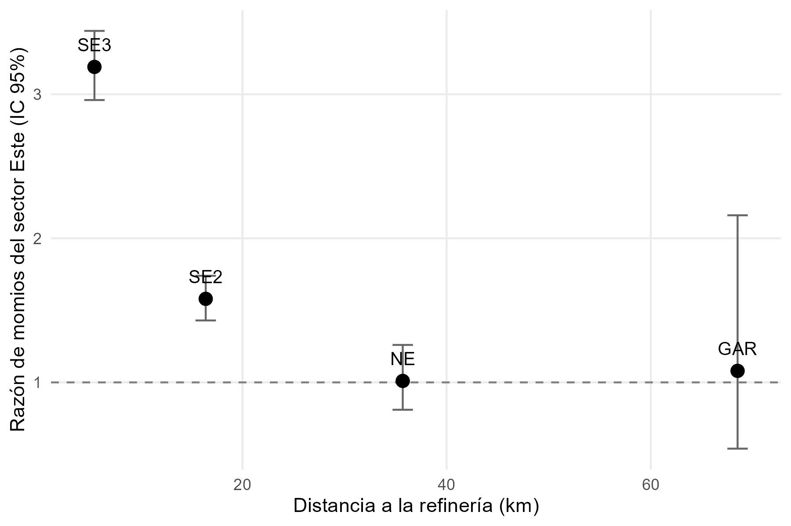
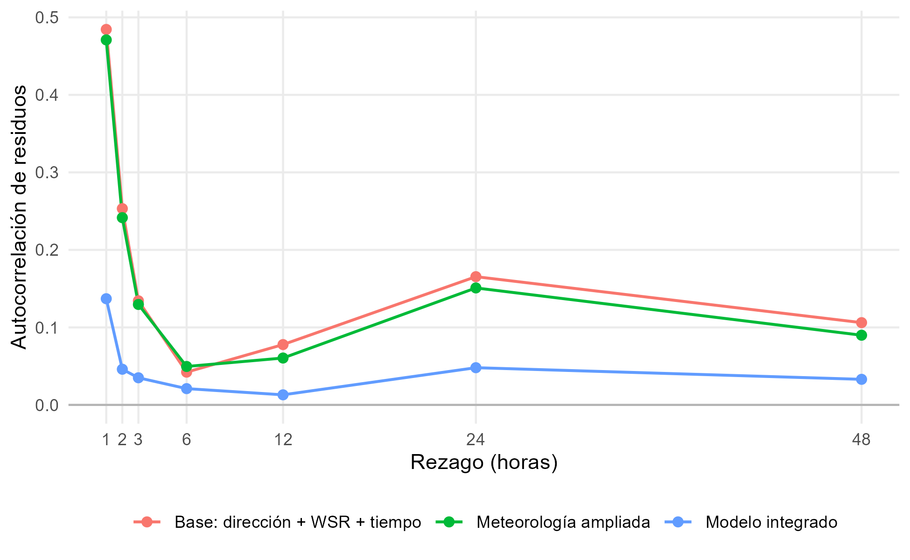
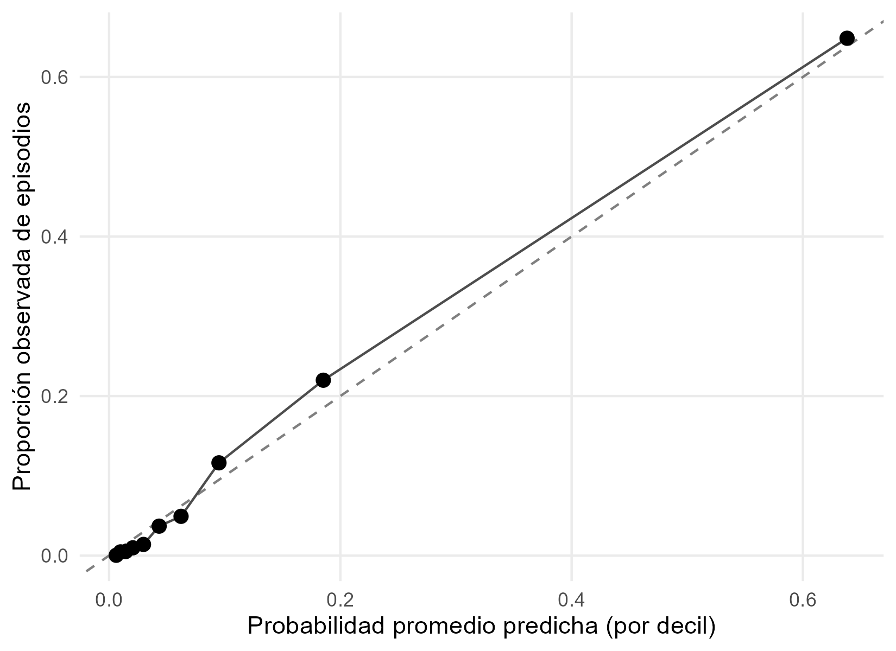
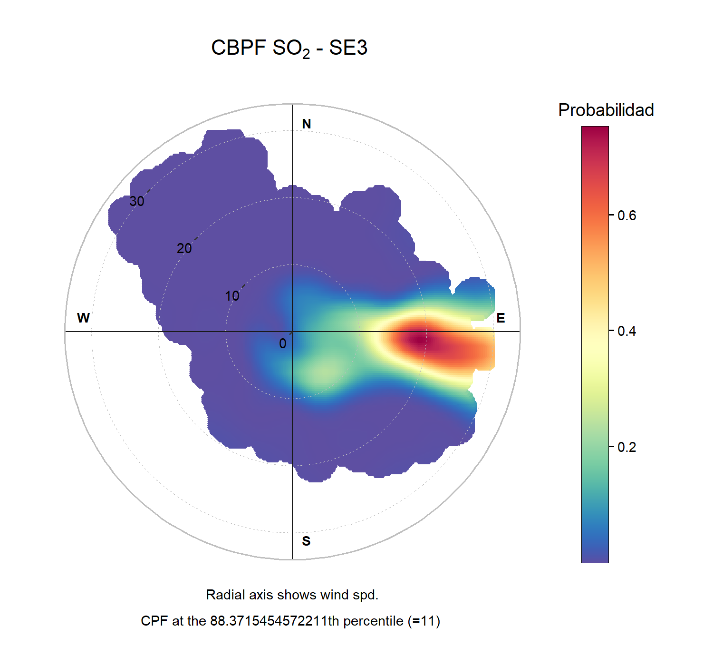
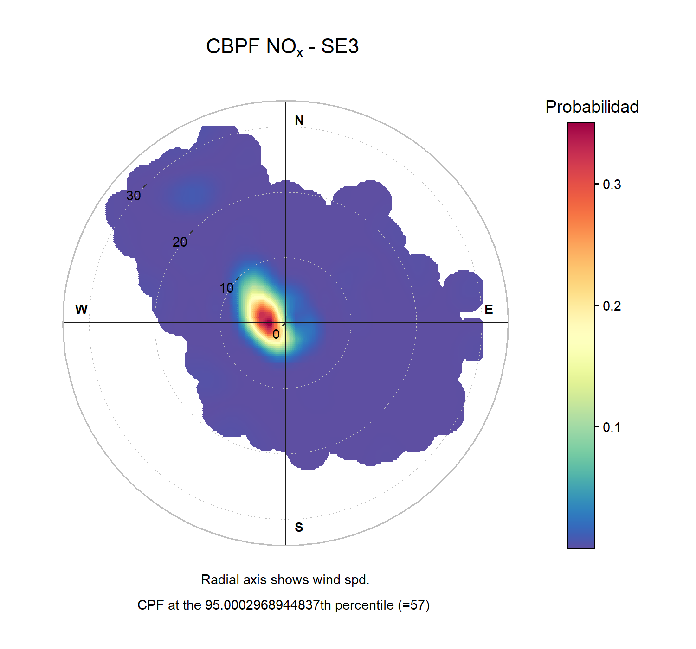
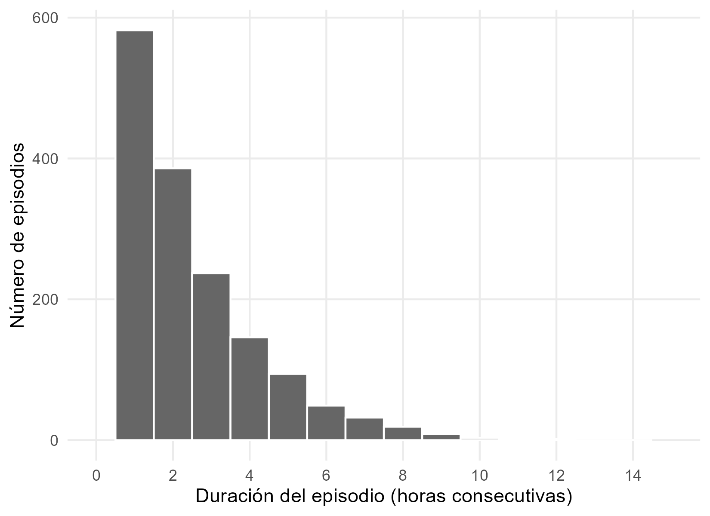
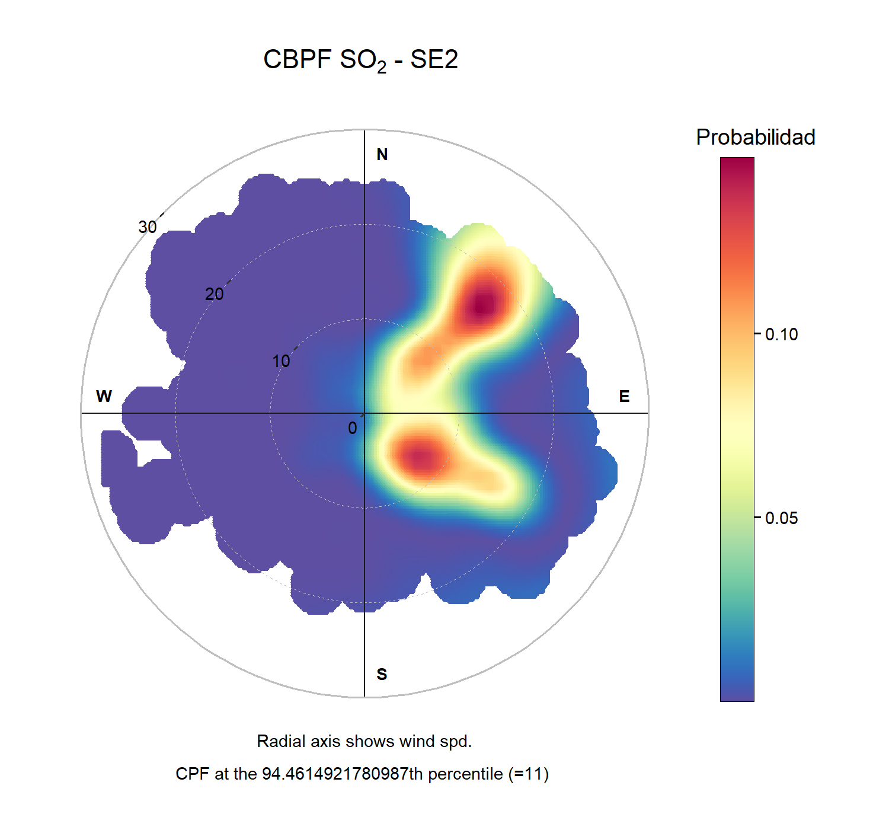
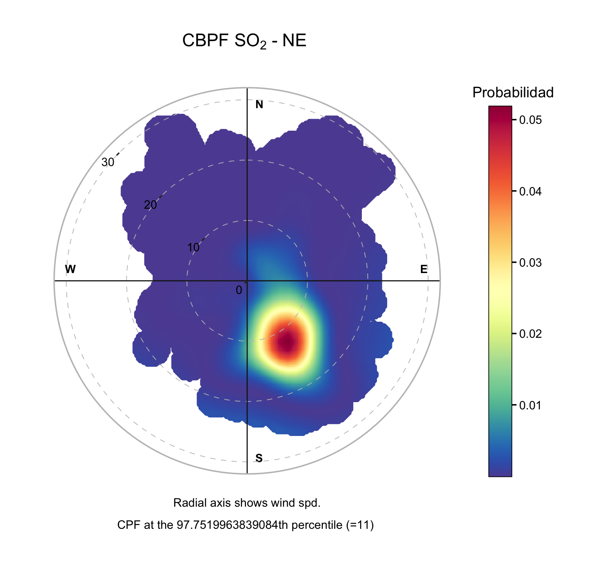

```{r}
#| label: carga

library(tidyverse)
library(knitr)

resultados_e3 <- readRDS("objetos_reporte_etapa3.rds")
resultados_e4 <- readRDS("objetos_reporte_etapa4.rds")

tabla_reporte <- function(datos, leyenda, digitos = 2) {
  kable(datos, caption = leyenda, digits = digitos, booktabs = TRUE)
}
```

# Resumen

El presente proyecto analiza el comportamiento de las concentraciones de dióxido de azufre registradas por el Sistema Integral de Monitoreo Ambiental de Nuevo León durante el periodo 2022-2025, con el objetivo de identificar patrones espaciales, direccionales y meteorológicos consistentes con la posible influencia de fuentes industriales localizadas en la zona de Cadereyta. El análisis se enfocó en las estaciones SE3 (Cadereyta), SE2 (Juárez), NE (San Nicolás) y GAR (García), esta última utilizada como punto de comparación por su mayor distancia respecto a la zona de interés. En particular, se buscó evaluar si los indicadores de tendencia central, como promedios y medianas anuales, representan adecuadamente la exposición a episodios agudos de SO2.

La base inicial estuvo conformada por 140,236 registros crudos y 19 variables correspondientes a contaminantes atmosféricos y condiciones meteorológicas. Como parte de la preparación de los datos se identificaron valores faltantes, registros fuera de los rangos establecidos por SIMA y posibles valores extremos. Las variables principales SO2, dirección del viento y velocidad del viento no fueron imputadas, con el fin de evitar la creación artificial de concentraciones o patrones direccionales. Para algunas variables meteorológicas secundarias se utilizó imputación mediante K vecinos más cercanos. 

Para estudiar las relaciones de dependencia se utilizaron modelos de regresión logística, mientras que la estructura conjunta de los contaminantes se analizó mediante componentes principales y conglomerados. Estos métodos se complementaron con análisis descriptivos, comparaciones entre estaciones y la Conditional Bivariate Probability Function (CBPF). Se definieron como episodios elevados las horas con concentraciones de SO2 superiores a 11.1 ppb, correspondiente al percentil 95 global de las cuatro estaciones. SE3 presentó la mayor frecuencia de episodios, con 11.63% de sus horas válidas, seguida de SE2 con 5.54%, NE con 2.25% y GAR con 0.15%.

El modelo logístico direccional identificó al sector Este como el de mayor asociación con la ocurrencia de episodios en SE3, con una razón de momios de 6.12 respecto al Norte. Este sector coincide con el azimut de 87.3° correspondiente a la ubicación de la refinería respecto a la estación. Además, la asociación se redujo conforme aumentó la distancia entre las estaciones y la zona de Cadereyta. El modelo presentó una capacidad discriminante adecuada, con un AUC de 0.811, mientras que una segunda especificación Este frente al resto obtuvo un AUC de 0.783 y mantuvo un desempeño similar al evaluarse con datos de 2025. La CBPF reprodujo de manera independiente el patrón direccional observado. Por otra parte, los análisis multivariados mostraron que los episodios de SO2 presentan una estructura distinta a la de contaminantes comúnmente asociados con combustión urbana.

En conjunto, los resultados son consistentes con la influencia de una fuente puntual de SO2 localizada al Este de SE3, aunque el análisis no permite establecer una atribución causal directa a una instalación específica. El principal contraste entre estaciones se encontró en la frecuencia de los episodios agudos y no únicamente en sus concentraciones típicas. Por ello, se recomienda que el seguimiento de la calidad del aire incorpore indicadores de frecuencia de excedencia junto con las medias y medianas anuales, con el fin de representar de manera más completa la exposición de la población a eventos elevados de SO2.

# Introducción y justificación

La calidad del aire condiciona de manera directa el bienestar de la población, y su deterioro se asocia con enfermedades cardiovasculares, padecimientos respiratorios y cáncer de pulmón. La Organización Mundial de la Salud estima que la contaminación del aire exterior ocasionó alrededor de 4.2 millones de muertes prematuras en 2019 (Organización Mundial de la Salud, 2024). Entre los contaminantes criterio, el dióxido de azufre presenta una particularidad relevante para este trabajo: sus efectos documentados corresponden principalmente a exposiciones de corta duración, lo que implica que su evaluación requiere métricas sensibles a eventos agudos y no únicamente a niveles promedio (Organización Mundial de la Salud, 2021; Holcim España, s. f.).

El marco normativo refleja esa distinción de manera parcial. Las directrices internacionales establecen valores guía sin carácter vinculante (Organización Mundial de la Salud, 2021), mientras que en México los límites para la protección de la salud se definen mediante normas oficiales, entre ellas la NOM-172-SEMARNAT-2019, que fija los lineamientos para la obtención y comunicación del Índice de Calidad del Aire y Riesgos a la Salud (Secretaría de Medio Ambiente y Recursos Naturales, 2019; Comisión Federal para la Protección contra Riesgos Sanitarios, s. f.). La medición enfrenta además dificultades operativas: la cobertura espacial es limitada, los equipos requieren calibración periódica y los registros presentan datos faltantes con frecuencia, de modo que cada estación representa fundamentalmente las condiciones de su entorno inmediato (Instituto Nacional de Ecología y Cambio Climático, s. f.; Programa de las Naciones Unidas para el Medio Ambiente, 2022). En Nuevo León, el Sistema Integral de Monitoreo Ambiental registra contaminantes y variables meteorológicas en distintos puntos del Área Metropolitana de Monterrey, y sus series históricas constituyen la fuente de datos de este proyecto (Gobierno del Estado de Nuevo León, s. f.).

## Antecedentes

Diversos estudios han utilizado concentraciones de contaminantes y variables meteorológicas para identificar posibles fuentes de emisión. Ashbaugh, Malm y Sadeh (1985) propusieron la función de probabilidad condicional para relacionar concentraciones elevadas con la dirección del viento, mientras que Carslaw et al. (2006) y Carslaw y Ropkins (2012) extendieron este enfoque al análisis de fuentes específicas y facilitaron su implementación mediante el paquete *openair*. Posteriormente, Uria-Tellaetxe y Carslaw (2014) desarrollaron la función de probabilidad bivariada condicional (CBPF), que incorpora simultáneamente dirección y velocidad del viento para caracterizar con mayor detalle el transporte de contaminantes. Aplicaciones en zonas industriales han mostrado que estas herramientas permiten diferenciar señales asociadas a fuentes locales. Clarke et al. (2014) identificaron patrones definidos de SO2 vinculados con áreas industriales, mientras que Xue et al. (2023) analizaron episodios recurrentes de SO2 y asociaron su comportamiento con una fuente puntual mediante información meteorológica. Estos antecedentes respaldan el uso combinado de concentraciones, dirección y velocidad del viento en el presente estudio.

## Justificación

Los antecedentes muestran que el análisis conjunto de concentraciones y condiciones meteorológicas permite detectar patrones compatibles con fuentes de emisión específicas. Sin embargo, para la gestión de la calidad del aire también es necesario evaluar si los indicadores de tendencia central representan adecuadamente exposiciones breves pero elevadas. Este proyecto aplica métodos direccionales a los registros de SIMA para cuantificar la exposición aguda asociada al sector identificado y contrastarla con las medidas de tendencia central utilizadas habitualmente, con el fin de valorar si los mecanismos actuales de seguimiento capturan adecuadamente este fenómeno.

# Problemática y objetivo

## Planteamiento

El Área Metropolitana de Monterrey concentra una importante actividad industrial y presenta condiciones geográficas que hacen que la dispersión de contaminantes dependa del régimen de vientos. En este contexto, el dióxido de azufre resulta especialmente relevante, ya que se relaciona principalmente con procesos de combustión de combustibles con contenido de azufre y puede actuar como indicador de fuentes industriales puntuales.
El problema central es que los indicadores de tendencia central pueden ocultar episodios breves de concentraciones elevadas. Si la contribución de una fuente se manifiesta principalmente mediante eventos de pocas horas, los promedios o medianas pueden mostrar condiciones relativamente estables aun cuando la frecuencia de exposición aguda sea considerable.

## Objetivo general

Cuantificar el exceso de exposición aguda a dióxido de azufre asociado al sector direccional donde se ubica el complejo refinador de Cadereyta, con el fin de evaluar si los indicadores de tendencia central que utilizan actualmente los instrumentos de gestión de la calidad del aire representan de manera adecuada dicha exposición.

## Pregunta de investigación

¿Los episodios elevados de dióxido de azufre presentan un patrón de dirección del viento y distancia consistente con la influencia de una fuente industrial localizada en la zona de Cadereyta, y qué magnitud de exposición aguda queda sin registrar cuando ese fenómeno se evalúa mediante medidas de tendencia central?

## Contexto geográfico de las estaciones de monitoreo

El análisis emplea cuatro estaciones de la red del Sistema Integral de Monitoreo Ambiental, seleccionadas por su posición relativa respecto al complejo refinador. El criterio de selección no fue la proximidad en sí misma, sino la posibilidad de construir un gradiente de distancia sobre el cual evaluar el comportamiento de la señal.

```{r}
#| label: tbl-estaciones

resultados_e3$geo %>%
  mutate(
    Municipio = c("Cadereyta Jiménez", "Juárez", "San Nicolás de los Garza", "García"),
    Papel = c("Estación de exposición", "Distancia intermedia",
              "Distancia lejana", "Estación de control")
  ) %>%
  select(Estacion, Municipio, azimut, rumbo, dist_km, Papel) %>%
  rename(
    `Estación` = Estacion,
    `Azimut (°)` = azimut,
    `Rumbo` = rumbo,
    `Distancia (km)` = dist_km
  ) %>%
  tabla_reporte(
    leyenda = "El azimut corresponde al ángulo geodésico desde la estación hacia el centroide del complejo, medido en sentido horario desde el norte. Las coordenadas de referencia son aproximadas y su efecto sobre la identificación del sector se evalúa al final de esta sección.",
    digitos = 1
  )
```

La estación SE3 se localiza en Cadereyta Jiménez, aproximadamente a 5.5 kilómetros del complejo refinador y en un azimut cercano a los 87 grados, correspondiente al rumbo este franco. Su entorno inmediato presenta baja densidad vehicular en comparación con el núcleo metropolitano, característica favorable para el análisis porque reduce la contribución de fuentes difusas de combustión. SE2, en Juárez, y NE, en San Nicolás de los Garza, se ubican a 16.4 y 35.7 kilómetros respectivamente, ambas dentro de la zona conurbada. GAR, en García, cumple función de control: se encuentra a 68.5 kilómetros y en el extremo occidental del área metropolitana, de modo que se sitúa en contra del patrón de viento dominante respecto de la fuente. Aunque su azimut hacia el complejo es de 110 grados, ese sector comprende la totalidad de la mancha urbana antes de alcanzar la refinería, por lo que cualquier señal asociada al sector oriental en esa estación corresponde a influencia urbana difusa.

Un rasgo común merece atención: las cuatro estaciones tienen el complejo hacia el este o el este sureste, con azimuts entre 87 y 120 grados. Si el sector oriental estuviera asociado a concentraciones elevadas por razones meteorológicas regionales, las cuatro deberían presentar asociaciones comparables. Debe señalarse que las coordenadas empleadas para ubicar el complejo corresponden a una estimación de su centroide, dado que ocupa una superficie aproximada de 612 hectáreas. Esta imprecisión no compromete la identificación del sector: la clasificación direccional emplea bandas de 22.5 grados, y un análisis de sensibilidad que desplaza el centroide 1.5 kilómetros en cada dirección cardinal arroja azimuts desde SE3 entre 72.4 y 102.7 grados, en todos los casos dentro del rango este noreste a este sureste.

# Preparación de la base de datos

## Origen y estructura

La información procede de los archivos horarios de la red del Sistema Integral de Monitoreo Ambiental correspondientes a 2022 a 2025, complementados con el catálogo de rangos de validación de los parámetros. La base de trabajo integra las cuatro estaciones seleccionadas a lo largo de los cuatro años y comprende 132,936 registros horarios. Incluye ocho contaminantes, expresados en partes por billón salvo el monóxido de carbono en partes por millón y el material particulado en microgramos por metro cúbico, junto con dirección y velocidad del viento, temperatura, humedad relativa, presión barométrica, radiación solar y precipitación. El dióxido de azufre constituye la variable de interés; los restantes contaminantes cumplen función de trazadores de falsación y las variables meteorológicas la de controles.

## Validación y tratamiento de datos faltantes

La revisión inicial identificó registros fuera de los intervalos físicamente posibles, entre ellos códigos de falla del equipo en temperatura y humedad, y presiones fuera del rango barométrico de la región. Toda observación situada fuera del rango de validación correspondiente se convirtió a valor faltante, utilizando la tabla de referencia del socio formador. Esos rangos no son constantes a lo largo del periodo, ya que reflejan cambios en la instrumentación: el límite superior de validación del dióxido de azufre pasa de 200 partes por billón en 2022 a 250 en 2023, 150 en 2024 y 405 en 2025. Por esa razón la validación se aplicó mediante la combinación de año y variable, dado que imponer el criterio de un solo año al periodo completo habría invalidado mediciones legítimas o conservado registros que el propio catálogo considera fuera de operación.

El criterio de imputación se estableció de manera diferenciada según la función de cada variable, por consideraciones de validez antes que de completitud. Las variables meteorológicas de control recibieron imputación por vecinos más cercanos, procedimiento razonable dado que son continuas, con alta autocorrelación temporal y fuerte estructura cíclica. Los contaminantes conservaron sus valores faltantes sin imputación alguna, decisión que constituye un requisito del diseño: imputar los trazadores de falsación equivaldría a fabricar precisamente los contrastes que el análisis busca someter a prueba, ya que la ausencia de respuesta en un trazador solo constituye evidencia si corresponde a mediciones reales. Por la misma razón, el dióxido de azufre no fue objeto de depuración por valores extremos, pues un criterio automático basado en el rango intercuartílico habría suprimido las horas de concentración elevada, que son el objeto mismo del estudio.

## Tratamiento de la dirección del viento

La dirección del viento es una variable circular, en la cual los valores cero y trescientos sesenta grados representan la misma condición física, por lo que su tratamiento como magnitud lineal produciría resultados incorrectos. Se aplicaron tres transformaciones complementarias: clasificación en dieciséis sectores de 22.5 grados, que permite incorporar el rumbo como factor categórico sin imponer orden; descomposición en componentes seno y coseno, que preserva la continuidad angular; y agrupación binaria del sector oriental, definido como la unión de los rumbos este noreste, este y este sureste, frente al resto de direcciones. De manera análoga, la hora y el mes se incorporaron mediante términos armónicos, de modo que la vigésimo tercera hora resulte contigua a la hora cero y diciembre contiguo a enero.

## Estructura del panel

El conjunto resultante constituye un panel deliberadamente no balanceado. Las cuatro estaciones no registran el mismo número de observaciones válidas, con un rango de 32,534 horas en GAR a 33,977 en SE3, diferencia que refleja la disponibilidad efectiva de los sensores y no un error de construcción. No se aplicó procedimiento de igualación alguno, ya que implicaría descartar información válida para satisfacer una simetría que el análisis no requiere. Conviene señalar, finalmente, una corrección respecto a documentos de etapas previas: las concentraciones de dióxido de azufre se expresan en partes por billón y la velocidad del viento en kilómetros por hora, conforme al catálogo del sistema de monitoreo, unidades que en materiales anteriores aparecieron de forma incorrecta sin afectar los resultados.

# Modelación y validación

## Criterio de selección de técnicas

La elección de los métodos respondió a tres características del fenómeno estudiado. La primera es que el objeto de interés son eventos discretos y poco frecuentes, no niveles continuos. La segunda es la marcada asimetría de la distribución del dióxido de azufre, con una razón entre el percentil 99 y la mediana de 12.57 en la estación más próxima a la fuente. La tercera es la naturaleza circular de la variable direccional, que impide su tratamiento como magnitud lineal.

Por esas razones se descartó el modelo de regresión lineal. Un modelo de ese tipo promediaría las horas de episodio, que representan el 11.6 por ciento de los registros en SE3, con las horas de comportamiento regular, diluyendo precisamente la señal que se busca caracterizar. Además, la asimetría de la distribución vulnera el supuesto de normalidad de los residuos.

## Técnica de relaciones de dependencia: regresión logística binaria

Se definió como episodio toda hora con concentración de dióxido de azufre superior a 11.1 partes por billón, valor correspondiente al percentil 95 del conjunto de las cuatro estaciones. La adopción de un umbral absoluto común resulta indispensable para la comparabilidad entre sitios. Un percentil calculado de manera individual para cada estación forzaría por construcción la misma proporción de episodios en todos los puntos, ocultando exactamente la diferencia espacial que el análisis busca medir.

Sobre esa variable binaria se estimó un modelo de regresión logística. La especificación incorpora el rumbo del viento como factor de dieciséis niveles sin jerarquía previa, controles meteorológicos mediante splines naturales de tres grados de libertad, y términos armónicos para hora y mes. El uso de splines en lugar de términos lineales obedece a que la relación entre velocidad del viento y probabilidad de episodio no es monótona: las condiciones de calma favorecen la acumulación local, mientras que las velocidades elevadas dispersan, de modo que el máximo se ubica en valores intermedios.

La regresión logística ofrece dos ventajas para este diseño. Modela directamente la probabilidad del evento, sin necesidad de transformar la variable de respuesta, y produce razones de momios que resultan interpretables y comparables entre estaciones y entre contaminantes medidos en unidades distintas.

## Técnicas de relaciones de interdependencia: componentes principales y conglomerados

El análisis direccional depende enteramente de la información meteorológica. Para obtener una verificación que no comparta ese supuesto se aplicaron dos técnicas de interdependencia sobre la matriz química de los ocho contaminantes, sin utilizar en ningún momento la dirección del viento.

El análisis de componentes principales examina si el dióxido de azufre comparte estructura de variación con los trazadores vehiculares. Si el contaminante de interés cargara de manera apreciable sobre el mismo eje que los óxidos de nitrógeno y el monóxido de carbono, la hipótesis de una fuente distinta a la combustión urbana quedaría debilitada con independencia del patrón direccional observado. Las variables se transformaron logarítmicamente y se estandarizaron antes del análisis. La transformación logarítmica atenúa la influencia de los valores extremos sobre la matriz de correlaciones sin eliminarlos del conjunto de observaciones.

El análisis de conglomerados por el método de k medias se aplicó sobre las puntuaciones de los primeros cuatro componentes, con el propósito de identificar perfiles horarios concretos. La agrupación emplea exclusivamente información química, y la asociación de los grupos resultantes con el sector direccional se examina con posterioridad, de manera que el algoritmo no dispone de información que pudiera inducir el resultado buscado.

## Técnicas complementarias y estrategia de validación

Como complemento al modelo principal se emplearon la prueba de Kruskal-Wallis y el estimador de Hodges-Lehmann para comparar las concentraciones entre estaciones sin asumir normalidad, así como la función de probabilidad bivariada condicional (CBPF) para verificar de forma no paramétrica la asociación entre episodios elevados y condiciones de viento. Además, se incorporaron rezagos horarios de SO2 para evaluar si el patrón observado podía explicarse únicamente por la persistencia temporal del contaminante.

La validación se realizó mediante estimación con datos de 2022-2024 y evaluación fuera de muestra en 2025, errores estándar agrupados por día, análisis de sensibilidad con los percentiles 90, 95 y 99, diagnóstico de autocorrelación residual y evaluación de calibración. Estas verificaciones permitieron contrastar explicaciones alternativas relacionadas con meteorología, dependencia temporal y elección del umbral. El esquema completo de validación se presenta en el Anexo F.

Durante el desarrollo también se exploraron alternativas que no resultaron adecuadas. La regresión lineal sobre la concentración se descartó por la asimetría de SO2 y el interés específico en eventos agudos; sus resultados se incluyen en el Anexo A. Asimismo, aunque el índice de silueta favoreció inicialmente dos conglomerados, se seleccionaron cuatro por su mayor interpretabilidad química, decisión detallada en el Anexo B.

# Resultados

## Caracterización de los episodios

El primer resultado corresponde a la distribución de los episodios entre las cuatro estaciones. La comparación emplea el umbral absoluto común de 11.1 partes por billón.

```{r}
#| label: tbl-episodios

resultados_e4$resumen_estaciones %>%
  select(Estacion, n, episodios, tasa_pct, P50, P99, razon_P99_P50) %>%
  setNames(c("Estación", "Horas válidas", "Episodios", "Tasa (%)",
             "Mediana", "P99", "P99 / Mediana")) %>%
  tabla_reporte(
    leyenda = "Frecuencia de episodios de dióxido de azufre por estación, con umbral absoluto de 11.1 ppb. Las concentraciones se expresan en partes por billón.",
    digitos = 2
  )
```

El contraste entre estaciones es pronunciado. SE3 registra 3,951 horas de episodio, equivalentes al 11.63 por ciento de sus registros válidos, mientras que GAR acumula 49 horas en el mismo periodo, es decir, el 0.15 por ciento, una diferencia de aproximadamente setenta y siete veces.

Esa diferencia no se refleja en los valores centrales. Las medianas de las cuatro estaciones se sitúan entre 3.3 y 4.4 partes por billón, un rango estrecho. Lo que distingue a SE3 no es su nivel habitual sino el comportamiento de la cola superior de su distribución: su percentil 99 alcanza 55.3 partes por billón frente a 7.4 en la estación de control, y la razón entre percentil 99 y mediana desciende de manera ordenada de 12.57 en SE3 a 2.24 en GAR. Este resultado anticipa el argumento central del trabajo, ya que el fenómeno reside en la frecuencia de eventos agudos y no en el nivel de fondo, de modo que cualquier indicador construido sobre medidas de tendencia central captará solo una fracción reducida de la diferencia entre ambos sitios.

## Asociación direccional

El modelo logístico se estimó sobre la estación SE3 incorporando los dieciséis rumbos como categorías equivalentes, con el norte como referencia, y controlando por velocidad del viento, hora y mes.

```{r}
#| label: tbl-momios16

resultados_e4$momios_16_rumbos %>%
  slice(c(1:5, 11:15)) %>%
  mutate(
    IC = sprintf("[%.2f, %.2f]", IC_inf, IC_sup),
    p = format.pval(p, digits = 2, eps = 1e-16)
  ) %>%
  select(Rumbo, OR, IC, p) %>%
  setNames(c("Rumbo", "Razón de momios", "IC 95%", "Valor p")) %>%
  tabla_reporte(
    leyenda = "Razones de momios por rumbo del viento en SE3, con el norte como categoría de referencia. Se presentan los cinco rumbos de mayor y de menor asociación; la tabla completa se incluye en el Anexo C.",
    digitos = 2
  )
```

El rumbo este presenta la mayor razón de momios, con 6.12 e intervalo de confianza entre 4.73 y 7.92, seguido del este sureste con 2.58 y el este noreste con 1.98. El modelo identificó este ordenamiento sin recibir información sobre la ubicación de la fuente investigada. La tabla completa de los dieciséis rumbos se presenta en el Anexo C.

El comportamiento del cuadrante opuesto resulta igualmente informativo. Los rumbos noroeste, nor noroeste, oeste y oeste noroeste presentan razones de momios entre 0.08 y 0.25, lo que representa reducciones de entre cuatro y doce veces respecto de la referencia. Dado que el núcleo del Área Metropolitana se localiza al oeste de Cadereyta, si los episodios fueran atribuibles al tráfico vehicular metropolitano cabría esperar momios elevados con vientos de ese sector; se observa exactamente el comportamiento inverso. El modelo resulta significativo frente al nulo, con una diferencia de devianza de 4,617.2 sobre 22 grados de libertad, y alcanza un área bajo la curva ROC de 0.811. La verificación geográfica, realizada con posterioridad a la estimación, sitúa la fuente en un azimut cercano a los 87 grados desde SE3, el mismo rumbo que el modelo señaló de manera independiente.

## Gradiente espacial

Si la asociación con el sector oriental respondiera a condiciones meteorológicas regionales y no a la presencia de una fuente puntual, las cuatro estaciones deberían presentar momios comparables, dado que todas tienen el complejo hacia el este o el este sureste.

```{r}
#| label: fig-gradiente
#| fig-cap: "Razón de momios del sector Este sobre la probabilidad de episodio, en función de la distancia de cada estación al complejo refinador. Las barras representan el intervalo de confianza al 95 por ciento y la línea punteada corresponde a la ausencia de efecto."
#| out-width: "60%"


```

El efecto se atenúa de manera sistemática con la distancia. En SE3, a 5.5 kilómetros, la razón de momios es de 3.19. En SE2, a 16.4 kilómetros, desciende a 1.58. En NE, a 35.7 kilómetros, alcanza 1.01, con un intervalo de confianza que incluye la unidad, lo que indica ausencia de efecto detectable. En esta última estación la coincidencia direccional con la fuente no produce incremento alguno en la probabilidad de episodio.

El patrón requiere la conjunción de dirección y proximidad, comportamiento característico de una pluma sujeta a dilución progresiva y no de un artefacto direccional de escala regional.

El caso de la estación de control merece una precisión. Su razón de momios de 1.08, con un intervalo amplio que incluye la unidad, resulta consistente con la influencia urbana difusa señalada en la sección de contexto geográfico, dado que su sector oriental comprende la totalidad de la zona metropolitana antes de alcanzar el complejo refinador.

La diferencia entre estaciones se verificó de manera formal mediante un modelo conjunto con interacción entre estación y sector. La prueba resulta significativa, con una diferencia de devianza de 195.77 sobre tres grados de libertad, y tanto el criterio de información de Akaike como el bayesiano favorecen la especificación que permite efectos distintos por estación.

```{r}
#| label: tbl-contrastes

resultados_e4$contrastes_por_estacion %>%
  as_tibble() %>%
  mutate(
    OR = exp(estimate),
    IC = sprintf("[%.2f, %.2f]", exp(asymp.LCL), exp(asymp.UCL)),
    p = format.pval(p.value, digits = 2, eps = 1e-16)
  ) %>%
  select(Estacion, OR, IC, p) %>%
  setNames(c("Estación", "Razón de momios", "IC 95%", "Valor p")) %>%
  tabla_reporte(
    leyenda = "Contraste del sector Este frente al resto de direcciones, estimado por estación en el modelo conjunto con controles específicos.",
    digitos = 2
  )
```

Los contrastes por estación confirman el patrón: la asociación es significativa en SE3 y SE2, y deja de serlo en NE y GAR, donde los valores p superan ampliamente cualquier nivel convencional.

## Persistencia del patrón ante controles meteorológicos

Una explicación alternativa plausible es que la asociación direccional refleje condiciones meteorológicas correlacionadas con el rumbo del viento y no la presencia de una fuente. Para evaluarla se amplió el modelo con temperatura, humedad relativa, presión atmosférica, radiación solar y precipitación, todas mediante splines naturales.

La selección por criterio bayesiano de información retuvo las cinco variables meteorológicas y descartó únicamente la precipitación. La pregunta relevante es si el bloque direccional conserva capacidad explicativa una vez incorporados esos controles. La prueba de razón de verosimilitudes entre el modelo meteorológico con dirección y el mismo modelo sin ella arroja una diferencia de devianza de 1,192.7 sobre quince grados de libertad, con un valor p inferior a cualquier nivel convencional.

```{r}
#| label: tbl-valmeteo

resultados_e4$validacion_meteo_2025 %>%
  setNames(c("Modelo", "AUC", "Error de Brier")) %>%
  tabla_reporte(
    leyenda = "Desempeño fuera de muestra en 2025 del modelo direccional frente al modelo con controles meteorológicos ampliados. Ambos fueron estimados con los años 2022 a 2024.",
    digitos = 3
  )
```

Un resultado que conviene señalar por su carácter negativo es que la ampliación meteorológica apenas modifica la capacidad predictiva: el área bajo la curva pasa de 0.789 a 0.794 y el error de Brier se deteriora ligeramente. Es decir, las variables meteorológicas adicionales no explican los episodios por sí solas ni desplazan al sector direccional, lo cual es precisamente la conclusión que interesa. La dirección del viento aporta información que la meteorología general no contiene.

## Persistencia del patrón ante la memoria temporal del contaminante

La segunda explicación alternativa es de naturaleza temporal. Dado que las concentraciones en horas consecutivas están correlacionadas, el patrón direccional podría reflejar la simple persistencia del contaminante: si una hora presenta concentración elevada, la siguiente tenderá a presentarla también, con independencia del rumbo del viento.

El diagnóstico de autocorrelación de los residuos confirma que este mecanismo opera. En el modelo base, la correlación entre residuos separados por una hora alcanza 0.484, y la incorporación de controles meteorológicos apenas la reduce a 0.471. La meteorología no sustituye un tratamiento explícito de la dependencia temporal.

Por esa razón se incorporaron rezagos horarios de la propia concentración, construidos sobre una rejilla horaria completa. La selección por criterio bayesiano retuvo los rezagos de una, dos, doce y veinticuatro horas. Su aportación es considerable, con una diferencia de devianza de 5,187.7 sobre cuatro grados de libertad. Aun así, el sector oriental conserva una razón de momios de 3.34, con intervalo de confianza entre 3.03 y 3.68.

```{r}
#| label: fig-acf
#| fig-cap: "Autocorrelación de los residuos de devianza en función del rezago horario, para el modelo base, el modelo con controles meteorológicos ampliados y el modelo integrado."
#| out-width: "65%"


```

## Modelo integrado

Las dos explicaciones alternativas anteriores se evaluaron de manera conjunta mediante cuatro modelos anidados estimados sobre exactamente las mismas 31,745 observaciones, condición necesaria para que los criterios de información y las pruebas de razón de verosimilitudes resulten comparables.

```{r}
#| label: tbl-integrado

resultados_e4$comparacion_integrada %>%
  setNames(c("Modelo", "AIC", "BIC")) %>%
  tabla_reporte(
    leyenda = "Criterios de información de los cuatro modelos anidados, estimados sobre las mismas observaciones del periodo 2022 a 2024. Valores menores indican mejor ajuste penalizado.",
    digitos = 1
  )
```

Dos pruebas establecen que los bloques son complementarios y no redundantes. Los rezagos aportan información después de controlar por meteorología, con una diferencia de devianza de 3,364.6 sobre cuatro grados de libertad. La meteorología aporta información después de controlar por la memoria temporal, con una diferencia de 245.7 sobre doce grados de libertad.

La prueba central del análisis consiste en eliminar el sector direccional del modelo integrado, conservando simultáneamente la meteorología ampliada y los rezagos. La devianza se deteriora en 401.8 puntos sobre un grado de libertad, con un valor p inferior a cualquier nivel convencional. El sector oriental aporta información que ninguna de las dos explicaciones alternativas contiene.

```{r}
#| label: tbl-importancia

resultados_e4$importancia_bloques %>%
  mutate(p = format.pval(p, digits = 2, eps = 1e-16)) %>%
  setNames(c("Bloque eliminado", "Δ Devianza", "gl", "Valor p")) %>%
  tabla_reporte(
    leyenda = "Deterioro del ajuste al eliminar cada bloque del modelo integrado, manteniendo los restantes. Valores mayores indican mayor contribución del bloque.",
    digitos = 1
  )
```

La estimación final del efecto direccional, con errores estándar agrupados por día para corregir la dependencia entre horas de una misma jornada, arroja una razón de momios de 3.38 con intervalo de confianza entre 3.06 y 3.74.

## Validación fuera de muestra

Los cuatro modelos se evaluaron sobre el año 2025, que no participó en la estimación.

```{r}
#| label: tbl-val2025

resultados_e4$validacion_2025 %>%
  left_join(resultados_e4$clasificacion_2025, by = "Modelo") %>%
  setNames(c("Modelo", "AUC", "Error de Brier", "Sensibilidad", "Especificidad")) %>%
  tabla_reporte(
    leyenda = "Desempeño de los cuatro modelos sobre el año 2025. El punto de corte para sensibilidad y especificidad se fijó en la tasa base observada durante el entrenamiento.",
    digitos = 3
  )
```

El modelo integrado alcanza un área bajo la curva de 0.896 frente a 0.761 del modelo base, con una reducción del error de Brier de 0.108 a 0.076. Con el punto de corte fijado en la tasa base del periodo de entrenamiento, obtiene una sensibilidad de 0.734 y una especificidad de 0.876.

```{r}
#| label: fig-calibracion
#| fig-cap: "Calibración del modelo integrado por deciles de riesgo predicho. La línea punteada representa la calibración perfecta."
#| out-width: "55%"


```

La prueba de Hosmer-Lemeshow resulta significativa, resultado esperable dado el tamaño de muestra, ya que esta prueba tiende a rechazar la hipótesis de buen ajuste ante desviaciones triviales cuando el número de observaciones es elevado. El examen por deciles muestra que las diferencias entre probabilidad predicha y proporción observada se mantienen por debajo de 3.5 puntos porcentuales en todos los casos, con la mayor desviación en el noveno decil. El modelo subestima ligeramente el riesgo en las categorías intermedias y recupera precisión en el decil de mayor riesgo, comportamiento favorable para un eventual uso como herramienta de alerta.

## Sensibilidad al umbral de episodio

```{r}
#| label: tbl-sensibilidad

resultados_e4$sensibilidad_umbral %>%
  filter(Estacion %in% c("SE3", "SE2")) %>%
  mutate(IC = sprintf("[%.2f, %.2f]", IC_inf, IC_sup)) %>%
  select(Percentil, Umbral_ppb, Estacion, OR, IC) %>%
  setNames(c("Percentil", "Umbral (ppb)", "Estación", "Razón de momios", "IC 95%")) %>%
  tabla_reporte(
    leyenda = "Razón de momios del sector Este bajo tres definiciones del umbral de episodio, en las dos estaciones con señal significativa. El detalle de las cuatro estaciones se presenta en el Anexo D.",
    digitos = 2
  )
```

La conclusión direccional no depende del umbral seleccionado. En SE3 la razón de momios se mantiene entre 2.57 y 3.38 a lo largo de los tres percentiles. En SE2 el momio crece con la severidad del umbral, de 1.43 a 1.75, patrón compatible con que la pluma alcance esa estación únicamente durante los episodios de mayor intensidad.

En la estación de control no fue posible estimar el modelo con el umbral más exigente, dado que registra menos de treinta horas por encima de 30.6 partes por billón en cuatro años. Esta imposibilidad constituye un resultado por derecho propio: el fenómeno que se estudia sencillamente no ocurre en ese sitio con intensidad suficiente para ser modelado.

## Falsación multicontaminante

El análisis anterior establece que los episodios de dióxido de azufre se asocian al sector oriental. Resta verificar si ese comportamiento es específico de este contaminante o si aparece de manera similar en los demás.

```{r}
#| label: tbl-falsacion

resultados_e4$falsacion_contaminantes %>%
  mutate(IC = sprintf("[%.2f, %.2f]", IC_inf, IC_sup)) %>%
  select(Contaminante, n, eventos, OR, IC) %>%
  setNames(c("Contaminante", "n", "Eventos", "Razón de momios", "IC 95%")) %>%
  tabla_reporte(
    leyenda = "Razón de momios del sector Este sobre la probabilidad de concentración elevada, por contaminante, en SE3. El evento se define en cada caso como la superación del percentil 95 de la distribución propia de la variable.",
    digitos = 2
  )
```

El dióxido de azufre es el único contaminante con razón de momios significativamente superior a la unidad, con un valor de 2.66. El monóxido de carbono y el ozono no muestran respuesta, con intervalos que incluyen el uno. Los óxidos de nitrógeno presentan momios de 0.22, es decir, la probabilidad de concentración elevada de estos trazadores se reduce a menos de una cuarta parte cuando el viento proviene del este. El material particulado muestra reducciones intermedias.

La razón entre el momio del dióxido de azufre y el de los óxidos de nitrógeno es de aproximadamente doce. La masa de aire procedente del sector oriental llega pobre en trazadores vehiculares, consistente con el carácter predominantemente rural de esa zona, pero transporta dióxido de azufre. Esta combinación es incompatible con las hipótesis de tráfico o combustión urbana difusa: bajo cualquiera de ellas los óxidos de nitrógeno aumentarían junto con el dióxido de azufre, no disminuirían.

## Verificación por método no paramétrico

```{r}
#| label: fig-cbpf-contraste
#| fig-cap: "Función de probabilidad bivariada condicional en SE3."
#| fig-subcap: TRUE
  #|   - "Dióxido de azufre"
  #|   - "Óxidos de nitrógeno"
#| layout-ncol: 2
#| out-width: "100%"



```

El contraste entre ambos paneles es diagnóstico. El dióxido de azufre presenta un lóbulo compacto orientado al este franco, con probabilidad condicional superior a 0.6, centrado en velocidades de viento moderadas. Los óxidos de nitrógeno, medidos por el mismo equipo en el mismo sitio y sobre las mismas horas, alcanzan su máximo en el centro del gráfico, es decir, en condiciones de calma, sin orientación preferente. Un máximo direccional corresponde a transporte desde una fuente externa, mientras que un máximo central corresponde a acumulación local bajo estancamiento atmosférico. La aplicación del mismo procedimiento a SE2 y NE, incluida en el Anexo E, confirma el gradiente: ninguna presenta lóbulo orientado hacia el azimut de la fuente. La coincidencia entre un método paramétrico con control de covariables y uno no paramétrico sin controles, que parten de supuestos distintos, refuerza la robustez del hallazgo.

## Estructura multivariada de la matriz química

Los resultados anteriores dependen enteramente de la información meteorológica. El análisis que sigue prescinde por completo de la dirección del viento y plantea una pregunta de naturaleza composicional: si el dióxido de azufre compartiera estructura de variación con los óxidos de nitrógeno y el monóxido de carbono, la hipótesis de una fuente distinta a la combustión urbana quedaría debilitada con independencia del patrón direccional documentado.

### Componentes principales

El análisis se aplicó sobre la matriz de los ocho contaminantes en SE3, con transformación logarítmica y estandarización previas. El procedimiento requiere casos completos: se conservaron 27,938 de las 33,977 observaciones, equivalentes al 82.2 por ciento, y 3,304 de los 3,951 episodios, es decir, el 83.6 por ciento. La similitud entre ambas proporciones indica que la exclusión por datos faltantes no eliminó de manera preferente las horas de episodio. La adecuación muestral se verificó mediante el índice de Kaiser-Meyer-Olkin, que alcanza 0.623, y la prueba de esfericidad de Bartlett, significativa. El índice se sitúa por encima del mínimo convencional aunque en el rango calificado como mediocre, resultado que no constituye una deficiencia sino una consecuencia del objeto de estudio, ya que desciende precisamente porque el dióxido de azufre mantiene correlaciones bajas con el resto de las variables.

```{r}
#| label: tbl-cargas

resultados_e3$cargas %>%
  setNames(c("Variable", "PC1 (48.6%)", "PC2 (19.4%)", "PC3 (9.7%)")) %>%
  tabla_reporte(
    leyenda = "Cargas de los tres primeros componentes principales sobre la matriz de contaminantes en SE3. El porcentaje entre paréntesis indica la varianza explicada por cada componente.",
    digitos = 3
  )
```

El primer componente, que explica el 48.6 por ciento de la varianza, agrupa con signo común a los óxidos de nitrógeno, el material particulado grueso y el monóxido de carbono, con cargas entre 0.278 y 0.481 en valor absoluto, mientras el ozono carga en sentido opuesto, comportamiento consistente con su titulación por óxido nítrico fresco. Se trata del eje de combustión urbana. La carga del dióxido de azufre sobre ese componente es de 0.029: el contaminante de interés resulta prácticamente ortogonal al eje que explica cerca de la mitad de la variación química total de la estación. Dicho de otro modo, las horas en que aumentan los trazadores de combustión no son las horas en que aumenta el dióxido de azufre. El segundo componente, con el 19.4 por ciento de la varianza, está encabezado por el propio dióxido de azufre con una carga de 0.604, acompañado del material particulado fino y del ozono, asociación con sentido químico dado que el dióxido de azufre se oxida a sulfato, componente del particulado fino secundario, y ambos procesos se favorecen durante las horas de mayor mezcla convectiva.

### Análisis de conglomerados

Sobre las puntuaciones de los cuatro primeros componentes se aplicó el algoritmo de k medias, empleando exclusivamente información química. El índice de silueta favorece una partición en dos grupos, con 0.418 frente a valores cercanos a 0.26 para particiones mayores; se optó por cuatro conglomerados atendiendo a criterios de interpretabilidad química y no al valor del índice, decisión detallada en el Anexo B. La partición seleccionada explica el 58.3 por ciento de la variación en el espacio de componentes y converge en cinco iteraciones.

```{r}
#| label: tbl-perfil

resultados_e3$perfil %>%
  mutate(razon = SO2_med / NOX_med) %>%
  select(grupo, n, pct, SO2_med, NOX_med, PM25_med, O3_med,
         WSR_med, razon, pct_Este, pct_episod) %>%
  setNames(c("Grupo", "n", "%", "SO2", "NOX", "PM2.5", "O3",
             "WSR", "SO2/NOX", "% Este", "% episodios")) %>%
  tabla_reporte(
    leyenda = "Perfil de los cuatro conglomerados en SE3. Las concentraciones corresponden a medianas, expresadas en partes por billón salvo PM2.5 en microgramos por metro cúbico y la velocidad del viento en kilómetros por hora. La razón SO2/NOX se calcula sobre las medianas de cada grupo.",
    digitos = 2
  )
```

El primer conglomerado agrupa el 14.7 por ciento de las horas, con mediana de dióxido de azufre de 16.2 partes por billón, casi cuatro veces superior a la de cualquier otro grupo, y mediana de óxidos de nitrógeno de 10.4, la más baja del conjunto. Concentra el 72.2 por ciento de todos los episodios y la mitad de sus horas corresponde a viento del sector este. El segundo conglomerado constituye su imagen especular: óxidos de nitrógeno en 51.8 partes por billón, cinco veces superior, con dióxido de azufre en apenas 4.4, velocidad de viento de 3.6 kilómetros por hora, la menor del conjunto, y solo 6.2 por ciento de horas con viento del este; el perfil corresponde a acumulación local bajo estancamiento atmosférico. La razón entre medianas resume el contraste: 1.56 en el primer conglomerado frente a 0.085 en el segundo, una diferencia de factor dieciocho. Ningún proceso de combustión produce simultáneamente concentraciones de dióxido de azufre cuatro veces mayores y de óxidos de nitrógeno cinco veces menores. El algoritmo identificó estas horas sin disponer de información meteorológica alguna.

## Contraste entre tendencia central y exposición aguda

Los resultados precedentes establecen la especificidad del fenómeno. La sección siguiente aborda su magnitud y la capacidad de los indicadores habituales para representarla.

### Diferencia de medianas frente a frecuencia de eventos

Se evaluó la diferencia entre estaciones para cada año mediante la prueba de Kruskal-Wallis, significativa en los cuatro años, y se cuantificó la magnitud mediante el estimador de Hodges-Lehmann.

```{r}
#| label: tbl-hl

resultados_e3$hl %>%
  mutate(IC = sprintf("[%.1f, %.1f]", IC_inf, IC_sup)) %>%
  select(Año, Med_SE3, Med_GAR, Dif_HL, IC) %>%
  setNames(c("Año", "Mediana SE3", "Mediana GAR",
             "Diferencia H-L", "IC 95%")) %>%
  tabla_reporte(
    leyenda = "Diferencia de medianas anuales entre SE3 y la estación de control, estimada mediante el desplazamiento de Hodges-Lehmann. Los valores se expresan en partes por billón.",
    digitos = 1
  )
```

El desplazamiento entre SE3 y la estación de control oscila entre 0.6 y 1.5 partes por billón según el año, con intervalos estrechos que confirman que difiere de cero, aunque de magnitud reducida en términos absolutos. Su comportamiento temporal resulta especialmente relevante: alcanza su máximo en 2023, con 1.5 partes por billón, y desciende de forma sostenida hasta 0.6 en 2025, menos de la mitad. Interpretado de manera aislada, ese resultado sugeriría una convergencia progresiva entre ambos sitios.

El recuento de horas de episodio arroja la lectura opuesta. En 2023, año de máxima diferencia de medianas, SE3 registró 689 horas de episodio, la cifra más baja del periodo; en 2025, año de mínima diferencia de medianas, registró 1,172, la segunda más alta. Ambas series evolucionan en sentidos contrarios. La divergencia se explica por la naturaleza del fenómeno: la mediana describe el comportamiento típico de la distribución y es insensible a su cola superior, que es donde reside la contribución de la fuente investigada. Ambos resultados son válidos de manera simultánea, ya que el nivel de fondo difiere poco entre ambas estaciones mientras la frecuencia de eventos agudos difiere en dos órdenes de magnitud.

### Duración de los episodios

```{r}
#| label: fig-duracion
#| fig-cap: "Distribución de la duración de los episodios de dióxido de azufre en SE3, medida en horas consecutivas por encima del umbral."
#| out-width: "55%"


```

Se identificaron 1,561 episodios en SE3 durante el periodo, con duración mediana de dos horas, percentil 75 en tres y percentil 95 en seis. Se trata de eventos breves y recurrentes antes que de periodos prolongados, característica con consecuencia directa sobre las métricas de evaluación: el percentil 99 horario en SE3 alcanza 55.3 partes por billón, mientras que el del promedio móvil de veinticuatro horas desciende a 26.0, prácticamente la mitad. Un episodio de dos horas queda diluido entre veintidós horas de concentración habitual.

El exceso de horas de episodio de SE3 respecto de la estación de control asciende a 3,902 en el periodo completo, equivalentes a 976 anuales, es decir, 40.6 días al año en que Cadereyta supera el umbral mientras la estación de control no lo hace. GAR acumula entre 9 y 20 horas anuales; SE3 supera las mil en tres de los cuatro años. Esta cifra puede interpretarse como indicador de exposición potencialmente evitable, bajo el supuesto de que eliminar la contribución del sector identificado aproximaría el comportamiento de SE3 al de una estación sin influencia industrial próxima. El supuesto es fuerte, por lo que debe entenderse como cota superior y no como contribución neta de la fuente.

# Discusión y conclusiones

## Síntesis de los hallazgos

El análisis establece cuatro resultados. Existe una asociación direccional específica entre los episodios de dióxido de azufre en Cadereyta y el sector oriental, que persiste después de controlar de manera simultánea por cinco variables meteorológicas y por la concentración del propio contaminante en horas anteriores, con una razón de momios final de 3.38 e intervalo entre 3.06 y 3.74. El efecto decae de forma sistemática con la distancia, desde 3.19 a cinco kilómetros y medio hasta 1.01 a treinta y cinco, pese a que las cuatro estaciones tienen el complejo hacia el mismo cuadrante; esta conjunción necesaria de dirección y proximidad es característica de una pluma sujeta a dilución y difícilmente compatible con un fenómeno meteorológico de escala regional.

Las pruebas de falsación resultan consistentes con un origen distinto a la combustión urbana: el sector oriental eleva la probabilidad de concentración alta de dióxido de azufre pero la reduce en óxidos de nitrógeno, con una razón entre ambos momios de aproximadamente doce, y las técnicas de interdependencia, que no emplean información meteorológica, sitúan al contaminante prácticamente ortogonal al eje de combustión urbana e identifican un grupo de horas con razón entre dióxido de azufre y óxidos de nitrógeno de 1.56 frente a 0.085 en el grupo de estancamiento. Finalmente, el fenómeno reside en la frecuencia de eventos agudos y no en el nivel de fondo: la diferencia de medianas no supera 1.5 partes por billón en ningún año, mientras el exceso de horas de episodio asciende a 976 anuales, equivalentes a 40.6 días.

## Alcance de las conclusiones

El diseño es observacional y no permite establecer atribución causal en sentido estricto, ya que no se dispone de datos de emisión de la fuente ni de un contrafactual experimental. Lo que el análisis establece es que los patrones documentados resultan difícilmente compatibles con las explicaciones alternativas evaluadas. La correlación entre el sector oriental y los episodios no implica causalidad por sí misma; lo que aproxima el análisis a una inferencia sobre la fuente es la combinación de cuatro elementos: el control estadístico de las explicaciones alternativas plausibles, la verificación de que el patrón decae con la distancia conforme a un mecanismo físico conocido, la especificidad química del contaminante que responde, y la coincidencia entre métodos que parten de supuestos distintos. Ninguno es concluyente de manera aislada; su convergencia es lo que sostiene la interpretación. Persisten dos limitaciones: sin un inventario de emisiones georreferenciado no es posible descartar otras fuentes industriales en el mismo sector, y las coordenadas empleadas son aproximadas, si bien el análisis de sensibilidad muestra que esa imprecisión no altera la identificación del sector.

## Implicaciones para el seguimiento de la calidad del aire

El contraste entre tendencia central y exposición aguda tiene consecuencias operativas directas. Un sistema de seguimiento basado en concentraciones medias o medianas anuales, como los que emplean los instrumentos de planeación vigentes en el área metropolitana (Secretaría de Medio Ambiente de Nuevo León, 2023), habría reportado convergencia entre Cadereyta y la estación de control durante 2025, precisamente el año en que la exposición aguda repuntó con mayor intensidad. El efecto de la ventana de promediación refuerza la observación: dado que los episodios duran dos horas en mediana, un promedio móvil de veinticuatro horas reduce el percentil 99 de 55.3 a 26.0 partes por billón. La métrica no es incorrecta, pero mide un fenómeno distinto del que ocurre. Esto resulta particularmente relevante para un contaminante cuyos efectos documentados sobre la salud corresponden a exposiciones de corta duración: un indicador insensible a eventos breves resulta inadecuado para un riesgo que se materializa en eventos breves.

## Recomendaciones

Del análisis se derivan cuatro recomendaciones para el socio formador. La primera consiste en incorporar métricas de frecuencia de excedencia a los mecanismos de seguimiento del programa de gestión vigente (Secretaría de Medio Ambiente de Nuevo León, 2023), de manera complementaria a los promedios anuales; su cálculo no requiere información adicional a la que la red ya genera. La segunda es considerar un esquema de alerta horaria condicionado a la dirección del viento en SE3, dado que el modelo integrado alcanza un área bajo la curva de 0.896 sobre un año que no participó en su estimación, desempeño suficiente para anticipar condiciones de riesgo en lugar de documentar los episodios una vez concluidos. La tercera es utilizar el exceso de horas de episodio respecto de una estación de control como indicador de exposición potencialmente evitable, ya que la cifra de 976 horas anuales proporciona una magnitud concreta y comunicable. La cuarta es evaluar la conveniencia de reforzar el monitoreo entre Cadereyta y Juárez, tramo donde la señal se atenúa de manera pronunciada y donde la ausencia de estaciones intermedias impide caracterizar la extensión espacial efectiva de la pluma.

## Preguntas que surgen del análisis

El trabajo deja abiertas cinco preguntas. ¿A qué obedece el repunte de episodios observado en 2025? Los datos disponibles no permiten distinguir entre cambios en la operación del complejo, variaciones meteorológicas interanuales o modificaciones en los procedimientos de medición. ¿Es estable el patrón direccional a lo largo del tiempo, o se está intensificando? La extensión del análisis a 2020 y 2021, disponibles en la base del sistema de monitoreo, permitiría evaluarlo. ¿Cambia la señal entre periodos de operación normal y paros de mantenimiento del complejo? Esta es la pregunta de mayor interés metodológico, ya que la comparación entre fases de actividad y de paro mantendría constantes la ubicación de las estaciones y el régimen de vientos mientras varía únicamente la actividad de la fuente, y constituiría la prueba más directa de la hipótesis. ¿Qué proporción de la población de Cadereyta se encuentra efectivamente expuesta durante los episodios? Su estimación requiere información sobre densidad de habitantes y modelación de dispersión que este análisis no incorpora. ¿Existen otras fuentes de emisión en el mismo sector oriental? Un inventario de emisiones georreferenciado permitiría discriminar entre la contribución del complejo y la de otros emisores potenciales.

## Conclusión

Los resultados obtenidos son consistentes con la existencia de una fuente puntual de dióxido de azufre ubicada al este de la estación SE3, cuya influencia se atenúa con la distancia y cuya firma química difiere de la de las fuentes de combustión urbana. La coincidencia entre el sector identificado estadísticamente y la ubicación del complejo refinador, junto con el comportamiento de los trazadores de falsación, hace de la refinería la explicación más parsimoniosa del patrón observado.

El hallazgo de mayor relevancia práctica no es, sin embargo, la identificación de la fuente, sino la constatación de que los indicadores de tendencia central subrepresentan de manera sistemática la exposición que este fenómeno genera. Una diferencia de medianas inferior a una parte por billón coexiste con un exceso de 976 horas anuales de episodio. Ambas cifras describen la misma realidad, pero solo la segunda refleja lo que la población efectivamente experimenta.

# Referencias

Ashbaugh, L. L., Malm, W. C., & Sadeh, W. Z. (1985). A residence time probability analysis of sulfur concentrations at Grand Canyon National Park. *Atmospheric Environment, 19*(8), 1263–1270.\
<https://doi.org/10.1016/0004-6981(85)90256-2>

Carslaw, D. C., Beevers, S. D., Ropkins, K., & Bell, M. C. (2006). Detecting and quantifying aircraft and other on-airport contributions to ambient nitrogen oxides in the vicinity of a large international airport. *Atmospheric Environment, 40*(28), 5424–5434.\
[https://doi.org/10.1016/j.atmosenv.2006.04.062](https://doi.org/10.1016/j.atmosenv.2006.04.062?utm_source=chatgpt.com)

Carslaw, D. C., & Ropkins, K. (2012). *openair—An R package for air quality data analysis*. *Environmental Modelling & Software, 27–28*, 52–61.\
[https://doi.org/10.1016/j.envsoft.2011.09.008](https://doi.org/10.1016/j.envsoft.2011.09.008?utm_source=chatgpt.com)

Clarke, K., Kwon, H.-O., & Choi, S.-D. (2014). Fast and reliable source identification of criteria air pollutants in an industrial city. *Atmospheric Environment, 95*, 239–248.\
<https://doi.org/10.1016/j.atmosenv.2014.06.040>

Comisión Federal para la Protección contra Riesgos Sanitarios. (2025, 1 de julio). *Normas Oficiales Mexicanas (NOM) de calidad del aire ambiente*. Gobierno de México.\
[https://www.gob.mx/cofepris/acciones-y-programas/4-normas-oficiales-mexicanas-nom-de-calidad-del-aire-ambiente](https://www.gob.mx/cofepris/acciones-y-programas/4-normas-oficiales-mexicanas-nom-de-calidad-del-aire-ambiente?utm_source=chatgpt.com)

Gobierno del Estado de Nuevo León. (s. f.). *Índice Aire y Salud: Reporte de la calidad del aire en la Zona Metropolitana de Monterrey*. Sistema Integral de Monitoreo Ambiental.\
[https://aire.nl.gob.mx/icars2020/map_calidad_icars.php](https://aire.nl.gob.mx/icars2020/map_calidad_icars.php?utm_source=chatgpt.com)

Hodges, J. L., Jr., & Lehmann, E. L. (1963). Estimates of location based on rank tests. *The Annals of Mathematical Statistics, 34*(2), 598–611.\
https://doi.org/10.1214/aoms/1177704172

Holcim España. (s. f.). *¿Qué es la calidad del aire y por qué es importante?*\
[https://www.holcim.es/que-es-la-calidad-del-aire-importancia-y-medicion](https://www.holcim.es/que-es-la-calidad-del-aire-importancia-y-medicion?utm_source=chatgpt.com)

Instituto Nacional de Ecología y Cambio Climático. (s. f.). *Sistema Nacional de Información de la Calidad del Aire (SINAICA)*. Gobierno de México.\
[https://sinaica.inecc.gob.mx/index.php](https://sinaica.inecc.gob.mx/index.php?utm_source=chatgpt.com)

Kruskal, W. H., & Wallis, W. A. (1952). Use of ranks in one-criterion variance analysis. *Journal of the American Statistical Association, 47*(260), 583–621.\
[https://doi.org/10.1080/01621459.1952.10483441](https://doi.org/10.1080/01621459.1952.10483441?utm_source=chatgpt.com)

Organización Mundial de la Salud. (2021). *Directrices mundiales de la OMS sobre la calidad del aire: Materia particulada (MP2,5 y MP10), ozono, dióxido de nitrógeno, dióxido de azufre y monóxido de carbono: Resumen ejecutivo*.\
[https://www.who.int/es/publications/i/item/9789240034433/](https://www.who.int/es/publications/i/item/9789240034433/?utm_source=chatgpt.com)

Organización Mundial de la Salud. (2024, 24 de octubre). *Contaminación del aire ambiente (exterior) y salud*.\
[https://www.who.int/es/news-room/fact-sheets/detail/ambient-(outdoor)-air-quality-and-health](https://www.who.int/es/news-room/fact-sheets/detail/ambient-%28outdoor%29-air-quality-and-health?utm_source=chatgpt.com)

Programa de las Naciones Unidas para el Medio Ambiente. (2022, 22 de septiembre). *¿Cómo se mide la calidad del aire?*\
[https://www.unep.org/es/noticias-y-reportajes/reportajes/como-se-mide-la-calidad-del-aire](https://www.unep.org/es/noticias-y-reportajes/reportajes/como-se-mide-la-calidad-del-aire?utm_source=chatgpt.com)

Secretaría de Medio Ambiente del Estado de Nuevo León. (2024). *Programa Integral de Gestión Estratégica de la Calidad del Aire 2023–2033 para el Área Metropolitana de Monterrey (PIGECA)*. Gobierno del Estado de Nuevo León.\
[https://aire.nl.gob.mx/docs/reportes/PIGECA_2023_2033.pdf](https://aire.nl.gob.mx/docs/reportes/PIGECA_2023_2033.pdf?utm_source=chatgpt.com)

Secretaría de Medio Ambiente y Recursos Naturales. (2024). *Norma Oficial Mexicana NOM-172-SEMARNAT-2023, Lineamientos para la obtención y comunicación del índice de calidad del aire y riesgos a la salud*. *Diario Oficial de la Federación*.\
[NOM-172-SEMARNAT-2023 en el Diario Oficial de la Federación](https://sidof.segob.gob.mx/notas/5715154?utm_source=chatgpt.com)

Uria-Tellaetxe, I., & Carslaw, D. C. (2014). Conditional bivariate probability function for source identification. *Environmental Modelling & Software, 59*, 1–9.\
<https://doi.org/10.1016/j.envsoft.2014.05.002>

Xue, Y., Cui, X., Li, K., Yu, Q., & Ma, W. (2023). Statistical source analysis of recurring sulfur dioxide pollution events in a chemical industrial park. *Atmospheric Environment, 296*, 119564.\
<https://doi.org/10.1016/j.atmosenv.2022.119564>

Xue, Y., Cui, X., Li, K., Yu, Q., & Ma, W. (2023). Statistical source analysis of recurring sulfur dioxide pollution events in a chemical industrial park. *Atmospheric Environment, 296*, 119564. <https://doi.org/10.1016/j.atmosenv.2022.119564>

# Anexos {.unnumbered}

## Anexo A. Regresión lineal sobre la concentración

Durante la definición de la estrategia de modelado se consideró estimar un modelo de regresión lineal que tomara como variable de respuesta la concentración horaria de dióxido de azufre, en lugar de la ocurrencia de episodio. La especificación se descartó por tres razones que conviene documentar.

La primera es de correspondencia entre el método y el objeto de estudio. El fenómeno de interés consiste en eventos discretos y poco frecuentes, que representan el 11.63 por ciento de las horas en la estación más próxima a la fuente. Un modelo que estima la media condicional de la concentración distribuye el peso de la estimación entre todas las observaciones, de modo que las horas de comportamiento regular, ampliamente mayoritarias, dominan el ajuste y la contribución de los episodios queda diluida.

La segunda es el incumplimiento del supuesto de normalidad de los residuos. La distribución del dióxido de azufre presenta una asimetría pronunciada, con una razón entre el percentil 99 y la mediana de 12.57 en SE3. Una variable con esa estructura genera residuos con cola derecha extensa, lo que invalida las pruebas de significancia y los intervalos de confianza construidos bajo el supuesto gaussiano. Las transformaciones habituales para corregir asimetría, como la logarítmica, comprimen precisamente el rango superior de la distribución, es decir, la región donde se manifiesta el fenómeno estudiado.

La tercera es de interpretación de los resultados. Un coeficiente de regresión lineal asociado al sector oriental expresaría el incremento promedio en partes por billón atribuible a esa dirección del viento. Esa magnitud resulta de escaso valor operativo, ya que la pregunta relevante para la gestión de la calidad del aire no es cuánto aumenta la concentración media, sino con qué frecuencia se supera un umbral de riesgo. La razón de momios de un modelo logístico responde directamente a esa pregunta y permite además comparar entre contaminantes medidos en unidades distintas, comparación indispensable para las pruebas de falsación.

Por estas razones la regresión lineal se descartó en la fase de diseño y no llegó a estimarse de manera definitiva.

## Anexo B. Selección del número de conglomerados

La determinación del número de grupos en el análisis de k medias se evaluó mediante el índice de silueta, que mide la cohesión interna de los conglomerados frente a su separación.

```{r}
#| label: tbl-silueta

resultados_e3$sil %>%
  setNames(c("Número de grupos", "Índice de silueta")) %>%
  tabla_reporte(
    leyenda = "Índice de silueta promedio para particiones de dos a seis grupos sobre las puntuaciones de los cuatro primeros componentes principales.",
    digitos = 3
  )
```

El índice favorece de manera clara la partición en dos grupos, con un valor de 0.418, frente a valores cercanos a 0.26 para las particiones de tres a seis. Pese a ello se adoptó la partición en cuatro conglomerados, decisión que responde a criterios de interpretabilidad química.

La partición en dos grupos separa las horas según su nivel general de contaminación, distinguiendo esencialmente entre condiciones limpias y condiciones cargadas. Esa separación, aunque estadísticamente más nítida, no permite distinguir entre mecanismos de origen distinto: agrupa en una misma clase las horas de acumulación urbana bajo estancamiento atmosférico y las horas de transporte desde el sector oriental, que son precisamente las dos situaciones que el análisis busca diferenciar.

La partición en cuatro grupos sí las separa, y produce dos conglomerados con perfiles químicos opuestos, uno con razón entre dióxido de azufre y óxidos de nitrógeno de 1.56 y otro con 0.085. Esa diferencia de factor dieciocho constituye el resultado de interés, y se pierde por completo bajo la partición de dos grupos.

El descenso del índice de silueta al aumentar el número de grupos era esperable dada la estructura de los datos, ya que los perfiles de contaminación atmosférica no forman clases discretas bien separadas sino un continuo con regiones de mayor densidad. En contextos de este tipo, el criterio de interpretabilidad resulta preferible a la optimización de un índice de separación geométrica.

## Anexo C. Razones de momios por rumbo del viento

```{r}
#| label: tbl-anexo-rumbos

resultados_e4$momios_16_rumbos %>%
  mutate(
    IC = sprintf("[%.3f, %.3f]", IC_inf, IC_sup),
    p = format.pval(p, digits = 3, eps = 1e-16)
  ) %>%
  select(Rumbo, OR, IC, p) %>%
  setNames(c("Rumbo", "Razón de momios", "IC 95%", "Valor p")) %>%
  tabla_reporte(
    leyenda = "Razones de momios de los quince rumbos estimados en SE3, con el norte como categoría de referencia. El modelo controla por velocidad del viento mediante splines naturales y por hora y mes mediante términos armónicos.",
    digitos = 3
  )
```

## Anexo D. Sensibilidad al umbral de episodio

```{r}
#| label: tbl-anexo-umbral

resultados_e4$sensibilidad_umbral %>%
  mutate(IC = sprintf("[%.2f, %.2f]", IC_inf, IC_sup)) %>%
  select(Percentil, Umbral_ppb, Estacion, OR, IC) %>%
  setNames(c("Percentil", "Umbral (ppb)", "Estación",
             "Razón de momios", "IC 95%")) %>%
  tabla_reporte(
    leyenda = "Razón de momios del sector Este bajo tres definiciones del umbral de episodio, en las cuatro estaciones. Los valores ausentes en GAR bajo el percentil 99 corresponden a la imposibilidad de estimación por número insuficiente de eventos.",
    digitos = 2
  )
```

La estación GAR no admite estimación bajo el percentil 99, dado que registra menos de treinta horas por encima de 30.6 partes por billón durante los cuatro años analizados. Esta limitación no constituye una deficiencia del procedimiento sino una consecuencia de la propia distribución de la variable en esa estación.

## Anexo E. Verificación direccional no paramétrica en SE2 y NE

```{r}
#| label: fig-anexo-cbpf
#| fig-cap: "Función de probabilidad bivariada condicional del dióxido de azufre en las estaciones intermedia y lejana."
#| fig-subcap:
#|   - "SE2, a 16.4 kilómetros"
#|   - "NE, a 35.7 kilómetros"
#| layout-ncol: 2
#| out-width: "100%"



```

Las escalas de color son independientes en cada panel, por lo que la comparación válida es la forma del patrón y no la magnitud absoluta.

La estación SE2 presenta dos focos de intensidad moderada, orientados hacia el nor noreste y el sur, sin correspondencia con el azimut del complejo refinador. La estación NE muestra su máximo hacia el sur, con probabilidad condicional un orden de magnitud menor que la observada en SE3 y sin contribución apreciable del sector oriental. Ambos resultados son consistentes con el gradiente obtenido mediante el modelo logístico.

## Anexo F. Matriz de sustento metodológico

```{r}
#| label: tbl-anexo-sustento

resultados_e4$matriz_sustento %>%
  setNames(c("Pregunta", "Método", "Qué comprueba")) %>%
  tabla_reporte(
    leyenda = "Correspondencia entre cada pregunta de validación, el método empleado para responderla y la explicación alternativa que permite descartar."
  )
```

## Anexo G. Validación del modelo meteorológico

```{r}
#| label: tbl-anexo-meteo

resultados_e4$validacion_meteo_2025 %>%
  setNames(c("Modelo", "AUC", "Error de Brier")) %>%
  tabla_reporte(
    leyenda = "Desempeño fuera de muestra en 2025 del modelo direccional frente al modelo con controles meteorológicos ampliados. Ambos fueron estimados con los años 2022 a 2024.",
    digitos = 3
  )
```

La ampliación meteorológica produce una mejora marginal en la capacidad de discriminación, con un incremento del área bajo la curva de 0.789 a 0.794, y un ligero deterioro en la calibración, con un aumento del error de Brier de 0.104 a 0.106. La interpretación relevante es que las variables meteorológicas adicionales no explican los episodios de manera autónoma. Su incorporación al modelo resulta pertinente como control estadístico, ya que permite verificar que la asociación direccional persiste al mantenerlas constantes, pero no constituye por sí misma una mejora predictiva sustantiva. \>\>\>\>\>\>\> 73bac3a383b20cffa46c9dccfdc757f04f182a5d
